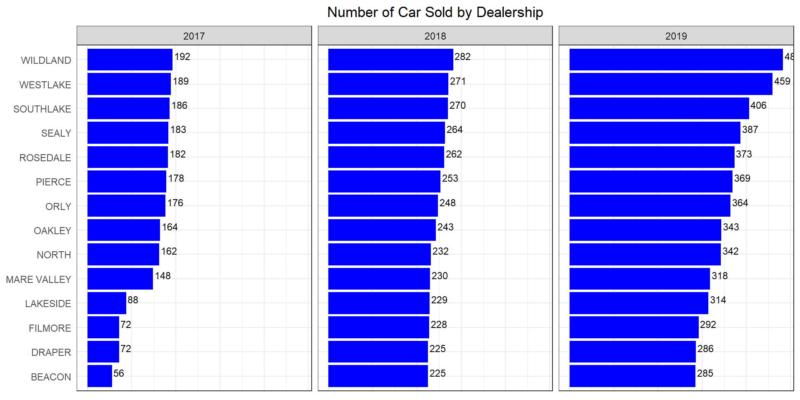

## Background

Recreate the chart

## Process

### Step 1

Packages


::: {.cell}

```{.r .cell-code}
#| echo: false


library(downloader) 
library(ggplot2) 
library(tidyverse)
```
:::

### Get the Data 


::: {.cell}
::: {.cell-output .cell-output-stdout}
```
# A tibble: 154 × 4
   ...1    `REGIONAL AVG` Names       Total
   <chr>            <dbl> <chr>       <dbl>
 1 2017 Q1             74 BEACON         69
 2 2017 Q1             74 DRAPER        130
 3 2017 Q1             74 FILMORE        85
 4 2017 Q1             74 LAKESIDE      117
 5 2017 Q1             74 MARE VALLEY    16
 6 2017 Q1             74 NORTH          74
 7 2017 Q1             74 OAKLEY         61
 8 2017 Q1             74 ORLY           51
 9 2017 Q1             74 PIERCE         35
10 2017 Q1             74 ROSEDALE       65
# ℹ 144 more rows
```
:::

::: {.cell-output .cell-output-stdout}
```
# A tibble: 154 × 5
   ...1    `REGIONAL AVG` Names       Total  year
   <chr>            <dbl> <chr>       <dbl> <dbl>
 1 2017 Q1             74 BEACON         69  2017
 2 2017 Q1             74 DRAPER        130  2017
 3 2017 Q1             74 FILMORE        85  2017
 4 2017 Q1             74 LAKESIDE      117  2017
 5 2017 Q1             74 MARE VALLEY    16  2017
 6 2017 Q1             74 NORTH          74  2017
 7 2017 Q1             74 OAKLEY         61  2017
 8 2017 Q1             74 ORLY           51  2017
 9 2017 Q1             74 PIERCE         35  2017
10 2017 Q1             74 ROSEDALE       65  2017
# ℹ 144 more rows
```
:::

::: {.cell-output .cell-output-stdout}
```
# A tibble: 42 × 4
# Groups:   year [3]
    year Names       num_of_rows   sum
   <dbl> <chr>             <int> <dbl>
 1  2017 BEACON                4    56
 2  2017 DRAPER                4    72
 3  2017 FILMORE               4    72
 4  2017 LAKESIDE              4    88
 5  2017 MARE VALLEY           4   148
 6  2017 NORTH                 4   162
 7  2017 OAKLEY                4   164
 8  2017 ORLY                  4   176
 9  2017 PIERCE                4   178
10  2017 ROSEDALE              4   182
# ℹ 32 more rows
```
:::

::: {.cell-output-display}
{width=960}
:::
:::


## Conclusions

NA
