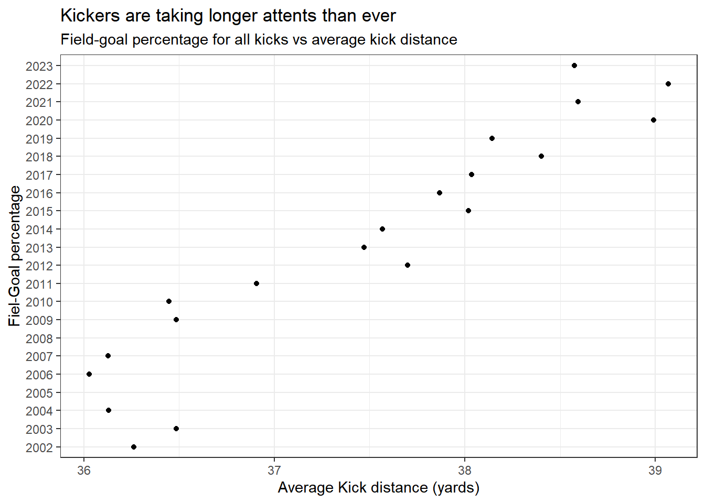

## Background

Recreate the chart

## Process

### Step 1

Packages


::: {.cell}

:::

### Get the Data 


::: {.cell}
::: {.cell-output .cell-output-stdout}
```
# A tibble: 20,566 × 13
   Date       Tm     Opp   Quarter Time   Down  ToGo Location Score Detail   EPB
   <date>     <chr>  <chr>   <dbl> <tim> <dbl> <dbl> <chr>    <chr> <chr>  <dbl>
 1 2013-12-15 Packe… Cowb…       1 08:21     4    12 DAL 39   3-3   Mason…  0.66
 2 2013-12-15 Vikin… Eagl…       1 09:33     4    14 PHI 37   0-0   Blair…  0.79
 3 2013-12-15 Bills  Jagu…       1 03:32     4     3 JAX 36   3-3   Dan C…  0.89
 4 2013-11-17 Bronc… Chie…       1 12:38     4     9 KAN 36   3-0   Matt …  0.88
 5 2013-09-29 Vikin… Stee…       1 12:12     4     8 PIT 36   3-0   Blair…  0.88
 6 2013-12-15 Jets   Pant…       1 00:01     4    10 CAR 36   3-3   Nick …  0.88
 7 2013-09-23 Bronc… Raid…       1 00:53     4     9 RAI 35   10-0  Matt …  0.97
 8 2013-11-10 Packe… Eagl…       1 06:28     4    14 PHI 35   0-0   Mason…  0.97
 9 2013-09-29 Jagua… Colts       1 08:18     4     4 CLT 35   3-0   Josh …  0.98
10 2013-09-26 49ers  Rams        1 09:12     4    13 RAM 35   0-0   Phil …  0.97
# ℹ 20,556 more rows
# ℹ 2 more variables: EPA <dbl>, Diff <dbl>
```
:::

::: {.cell-output .cell-output-stdout}
```
 [1] "Date"     "Tm"       "Opp"      "Quarter"  "Time"     "Down"    
 [7] "ToGo"     "Location" "Score"    "Detail"   "EPB"      "EPA"     
[13] "Diff"    
```
:::

::: {.cell-output .cell-output-stdout}
```
# A tibble: 22 × 2
   years yards
   <chr> <dbl>
 1 2002   36.3
 2 2003   36.5
 3 2004   36.1
 4 2005   NA  
 5 2006   36.0
 6 2007   36.1
 7 2008   NA  
 8 2009   36.5
 9 2010   36.4
10 2011   36.9
# ℹ 12 more rows
```
:::

::: {.cell-output-display}
{width=672}
:::
:::
