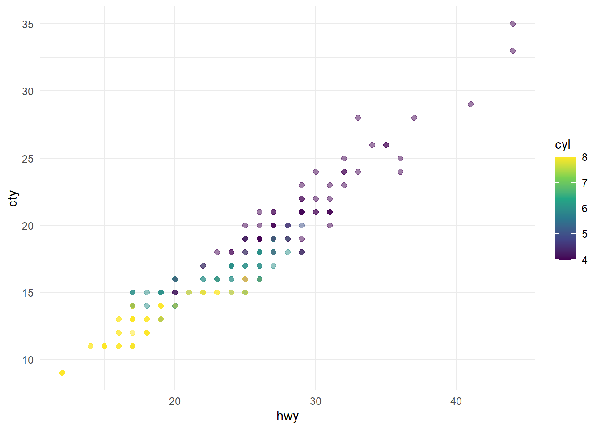

This dataset contains a subset of the fuel economy data from the EPA. Specifically, we use the `mpg` dataset from the **ggplot2** package.


::: {.cell}

:::


The visualization below shows a positive, strong, and linear relationship between the city and highway mileage of these cars. Additionally, mileage is higher for cars with fewer cylinders.


::: {.cell}

```{.r .cell-code}
ggplot(mpg, aes(x = hwy, y = cty, color = cyl)) +
  geom_point(alpha = 0.5, size = 2) +
  scale_color_viridis_c() +
  theme_minimal()
```

::: {.cell-output-display}
{width=672}
:::
:::
