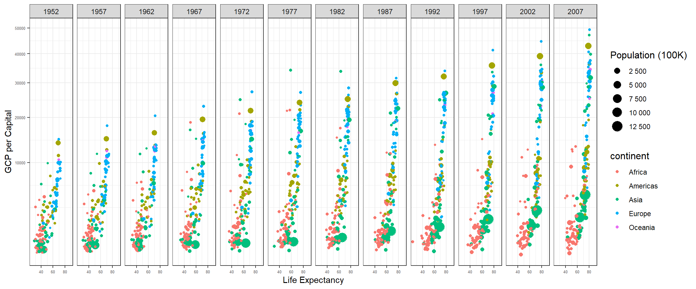

## 1. Background

Use a .qmd file to recreate the graphic shown below using gapminder dataset from library(gapminder) (get them to match as closely as you can).

## 2. Load packages as needed


::: {.cell}

```{.r .cell-code}
# library gapminder
library(gapminder)
library(tidyverse)
```
:::


## 3. Understanding the Dataset

**Head of the table**


::: {.cell}
::: {.cell-output .cell-output-stdout}
```
# A tibble: 5 × 6
  country     continent  year lifeExp      pop gdpPercap
  <fct>       <fct>     <int>   <dbl>    <int>     <dbl>
1 Afghanistan Asia       1952    28.8  8425333      779.
2 Afghanistan Asia       1957    30.3  9240934      821.
3 Afghanistan Asia       1962    32.0 10267083      853.
4 Afghanistan Asia       1967    34.0 11537966      836.
5 Afghanistan Asia       1972    36.1 13079460      740.
```
:::
:::

**Dataset description**

::: {.cell}
::: {.cell-output .cell-output-stdout}
```
tibble [1,704 × 6] (S3: tbl_df/tbl/data.frame)
 $ country  : Factor w/ 142 levels "Afghanistan",..: 1 1 1 1 1 1 1 1 1 1 ...
 $ continent: Factor w/ 5 levels "Africa","Americas",..: 3 3 3 3 3 3 3 3 3 3 ...
 $ year     : int [1:1704] 1952 1957 1962 1967 1972 1977 1982 1987 1992 1997 ...
 $ lifeExp  : num [1:1704] 28.8 30.3 32 34 36.1 ...
 $ pop      : int [1:1704] 8425333 9240934 10267083 11537966 13079460 14880372 12881816 13867957 16317921 22227415 ...
 $ gdpPercap: num [1:1704] 779 821 853 836 740 ...
```
:::
:::


## 3. Procedure

**Removing Kuwait from data**


::: {.cell}
::: {.cell-output .cell-output-stdout}
```
tibble [1,692 × 6] (S3: tbl_df/tbl/data.frame)
 $ country  : Factor w/ 142 levels "Afghanistan",..: 1 1 1 1 1 1 1 1 1 1 ...
 $ continent: Factor w/ 5 levels "Africa","Americas",..: 3 3 3 3 3 3 3 3 3 3 ...
 $ year     : int [1:1692] 1952 1957 1962 1967 1972 1977 1982 1987 1992 1997 ...
 $ lifeExp  : num [1:1692] 28.8 30.3 32 34 36.1 ...
 $ pop      : int [1:1692] 8425333 9240934 10267083 11537966 13079460 14880372 12881816 13867957 16317921 22227415 ...
 $ gdpPercap: num [1:1692] 779 821 853 836 740 ...
```
:::
:::

**Graph**

::: {.cell}
::: {.cell-output-display}
{width=1152}
:::
:::


## Conclusions

N/A