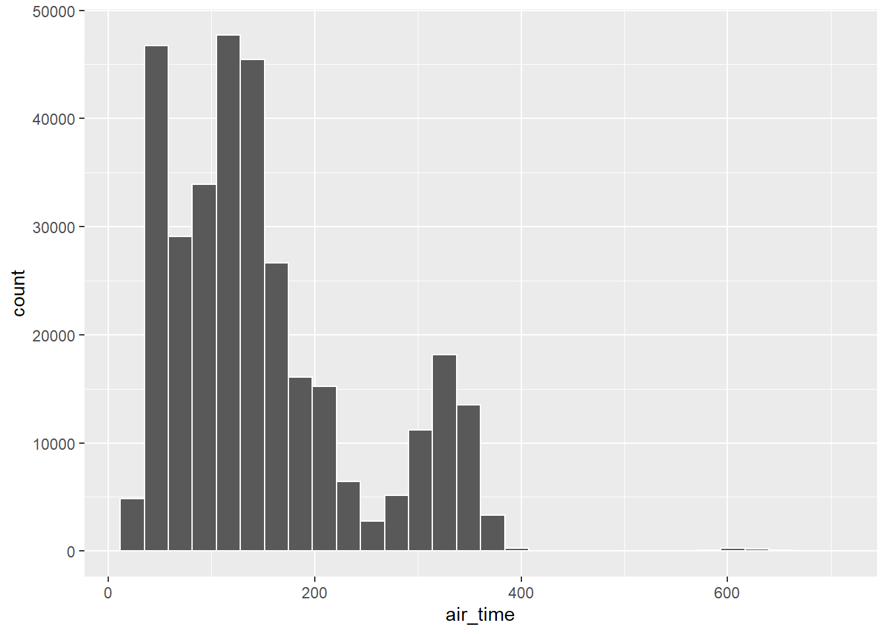
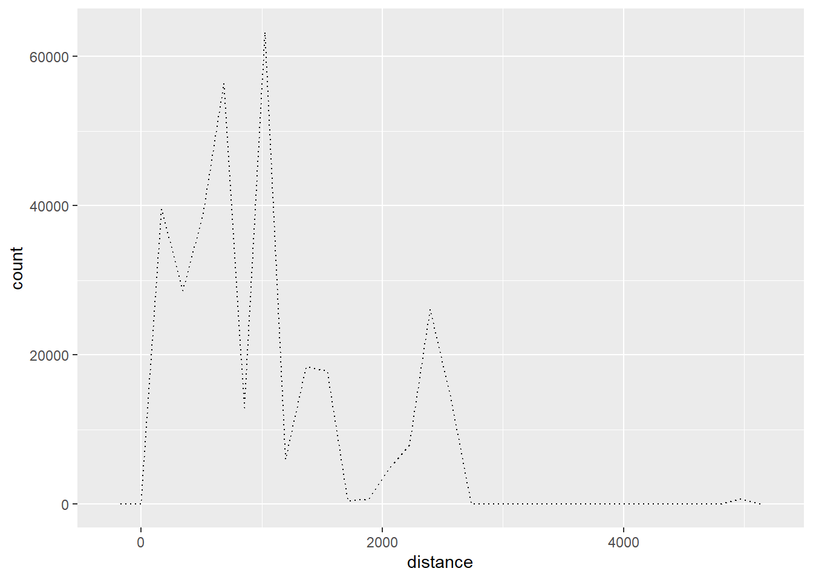
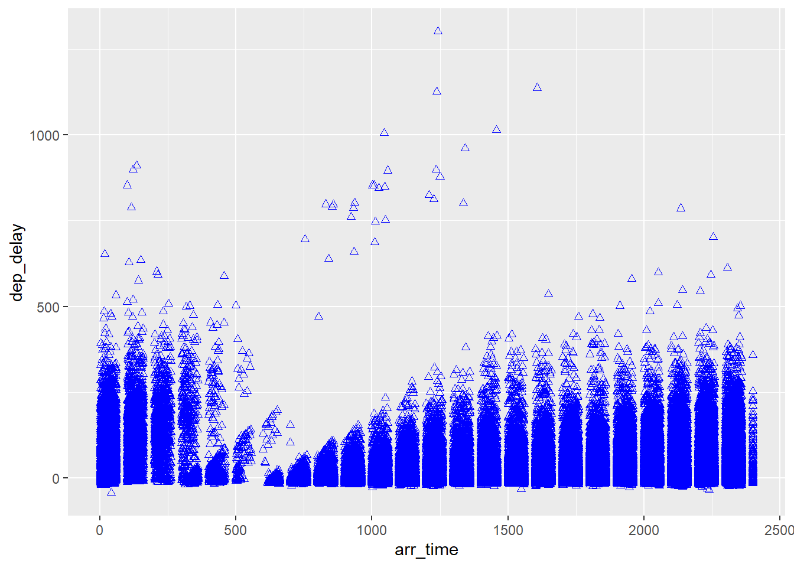

## 1. Background

You just started your internship at a big firm in New York, and your manager gave you an extensive file of flights that departed JFK, LGA, or EWR in 2013. From this data (which you can obtain in R) your manager wants you draw some insights.

## 2. Use a Flights dataset


::: {.cell}

```{.r .cell-code}
# library tidyverse and nycflights13 installed
library(tidyverse)
# install.packages('nycflights13')
```
:::


#### Example of the first rows of the data


::: {.cell}
::: {.cell-output .cell-output-stdout}
```
# A tibble: 5 × 19
   year month   day dep_time sched_dep_time dep_delay arr_time sched_arr_time
  <int> <int> <int>    <int>          <int>     <dbl>    <int>          <int>
1  2013     1     1      517            515         2      830            819
2  2013     1     1      533            529         4      850            830
3  2013     1     1      542            540         2      923            850
4  2013     1     1      544            545        -1     1004           1022
5  2013     1     1      554            600        -6      812            837
# ℹ 11 more variables: arr_delay <dbl>, carrier <chr>, flight <int>,
#   tailnum <chr>, origin <chr>, dest <chr>, air_time <dbl>, distance <dbl>,
#   hour <dbl>, minute <dbl>, time_hour <dttm>
```
:::
:::


## 3. Picking variables and relationships (air_time and distance )

### Air Time


::: {.cell}
::: {.cell-output-display}
{width=672}
:::
:::


### distance


::: {.cell}
::: {.cell-output-display}
{width=672}
:::
:::


### Arrival time over departure delay


::: {.cell}
::: {.cell-output-display}
{width=672}
:::
:::


## Conclusions

From the air time variable, we see that between 0 and 200 minutes represent 80% of air time. It may be that that the company only flight small distance or they like to go fast. It raises more question at this point.

The second graph, we see the distance between airports. It´s not a surprise that the range it is big for more than 4,000 miles (at this point not central analysis was conducted to see how far). So, there are some close and far away airports. 

The last graph, is the relation between Arrival time over departure delay. it is interesting to see that even though there are considerable delays in departure the count of the arrival time is constant. We need further analyses against the forecast. I wonder if they are arriving on time or not. 