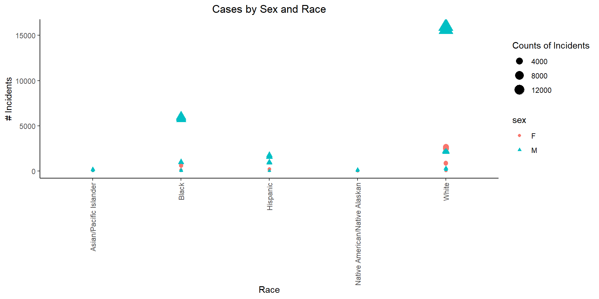
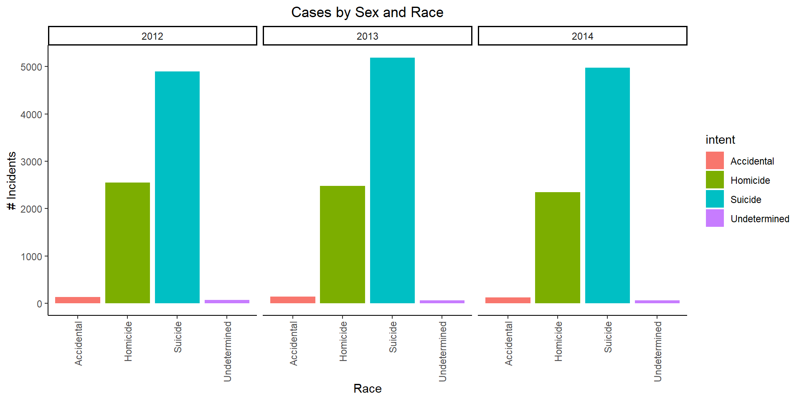

## 1. Write a short paragraph summarizing their article
The article gives the methodology used to create the graph visualized in the page. The interactive graphic depicts data from different data sources such as Center for disease, FBI´s count, and Mother Jone´s database. Speaking about the graph, it seems easy to understand and has filters. It also shows percentage from the total and this is how it drives its conclusion. However, the graph seems too crowded and makes me dizzy. I should have picked a different style.

## 2. Load packages as needed


::: {.cell}

```{.r .cell-code}
# library gapminder
#install.packages("realdxl")
library(downloader)
library(ggplot2) 
library(tidyverse)
library(readxl)
```
:::


## 3. Understanding the Dataset

**Background**
The world is a dangerous place. Police shootings, mass shootings, and apparently random shootings consistently seem to be in the headlines. The solution to the problem is politically controversial. FiveThirtyEight reported on gun deaths in 2016. As leaders in data journalism, they have posted a clean version of this data in their GitHub repo called full_data.csv for us to use.

While their visualizations focused on yearly averages, our client wants to create commercials that help reduce the gun deaths in the US. They would like to target the commercials in different seasons of the year (think month variable) to audiences that could have the most impact in reducing gun deaths. Our challenge is to summarize and visualize seasonal trends across the other variables in these data.

## 3.1 Understanding the Dataset

**Head of the table and description**


::: {.cell}

:::

::: {.cell}

```{.r .cell-code}
download("https://github.com/fivethirtyeight/guns-data/raw/master/full_data.csv", dest="myxl.csv", mode="wb")

df <-read_csv("myxl.csv")
```
:::

::: {.cell}

```{.r .cell-code}
head(df,5)
```

::: {.cell-output .cell-output-stdout}
```
# A tibble: 5 × 11
   ...1  year month intent  police sex     age race     hispanic place education
  <dbl> <dbl> <chr> <chr>    <dbl> <chr> <dbl> <chr>       <dbl> <chr> <chr>    
1     1  2012 01    Suicide      0 M        34 Asian/P…      100 Home  BA+      
2     2  2012 01    Suicide      0 F        21 White         100 Stre… Some col…
3     3  2012 01    Suicide      0 M        60 White         100 Othe… BA+      
4     4  2012 02    Suicide      0 M        64 White         100 Home  BA+      
5     5  2012 02    Suicide      0 M        31 White         100 Othe… HS/GED   
```
:::
:::

**Dataset description**

::: {.cell}
::: {.cell-output .cell-output-stdout}
```
spc_tbl_ [100,798 × 11] (S3: spec_tbl_df/tbl_df/tbl/data.frame)
 $ ...1     : num [1:100798] 1 2 3 4 5 6 7 8 9 10 ...
 $ year     : num [1:100798] 2012 2012 2012 2012 2012 ...
 $ month    : chr [1:100798] "01" "01" "01" "02" ...
 $ intent   : chr [1:100798] "Suicide" "Suicide" "Suicide" "Suicide" ...
 $ police   : num [1:100798] 0 0 0 0 0 0 0 0 0 0 ...
 $ sex      : chr [1:100798] "M" "F" "M" "M" ...
 $ age      : num [1:100798] 34 21 60 64 31 17 48 41 50 NA ...
 $ race     : chr [1:100798] "Asian/Pacific Islander" "White" "White" "White" ...
 $ hispanic : num [1:100798] 100 100 100 100 100 100 100 100 100 998 ...
 $ place    : chr [1:100798] "Home" "Street" "Other specified" "Home" ...
 $ education: chr [1:100798] "BA+" "Some college" "BA+" "BA+" ...
 - attr(*, "spec")=
  .. cols(
  ..   ...1 = col_double(),
  ..   year = col_double(),
  ..   month = col_character(),
  ..   intent = col_character(),
  ..   police = col_double(),
  ..   sex = col_character(),
  ..   age = col_double(),
  ..   race = col_character(),
  ..   hispanic = col_double(),
  ..   place = col_character(),
  ..   education = col_character()
  .. )
 - attr(*, "problems")=<externalptr> 
```
:::
:::


## 3. Procedure

**cleaning: Summary and Description**


::: {.cell}

```{.r .cell-code}
dfclean <- transform(df,month=as.numeric(month))# chaging month to number
#dfsummary(dfclean) 
str(dfclean)
```

::: {.cell-output .cell-output-stdout}
```
'data.frame':	100798 obs. of  11 variables:
 $ ...1     : num  1 2 3 4 5 6 7 8 9 10 ...
 $ year     : num  2012 2012 2012 2012 2012 ...
 $ month    : num  1 1 1 2 2 2 2 3 2 2 ...
 $ intent   : chr  "Suicide" "Suicide" "Suicide" "Suicide" ...
 $ police   : num  0 0 0 0 0 0 0 0 0 0 ...
 $ sex      : chr  "M" "F" "M" "M" ...
 $ age      : num  34 21 60 64 31 17 48 41 50 NA ...
 $ race     : chr  "Asian/Pacific Islander" "White" "White" "White" ...
 $ hispanic : num  100 100 100 100 100 100 100 100 100 998 ...
 $ place    : chr  "Home" "Street" "Other specified" "Home" ...
 $ education: chr  "BA+" "Some college" "BA+" "BA+" ...
```
:::
:::

**Graph 1**

::: {.cell}
::: {.cell-output .cell-output-stdout}
```
# A tibble: 30 × 4
# Groups:   year, sex [6]
    year sex   race                           count
   <dbl> <chr> <chr>                          <int>
 1  2012 F     Asian/Pacific Islander            80
 2  2012 F     Black                            818
 3  2012 F     Hispanic                         337
 4  2012 F     Native American/Native Alaskan    39
 5  2012 F     White                           3451
 6  2012 M     Asian/Pacific Islander           373
 7  2012 M     Black                           7128
 8  2012 M     Hispanic                        2724
 9  2012 M     Native American/Native Alaskan   271
10  2012 M     White                          18342
# ℹ 20 more rows
```
:::

::: {.cell-output-display}
{width=960}
:::
:::

This graph represents the number of cases per year between sex. This is showing that more of the cases are represented by Male.


**Graph 2**

::: {.cell}
::: {.cell-output-display}
{width=960}
:::
:::


**Graph 3-5**

::: {.cell}
::: {.cell-output-display}
{width=960}
:::

::: {.cell-output-display}
{width=960}
:::
:::

This graph represents the number of incidents by sex and races. It seems that we have more incidents by Male white people follow by black people.

## Conclusions

N/A