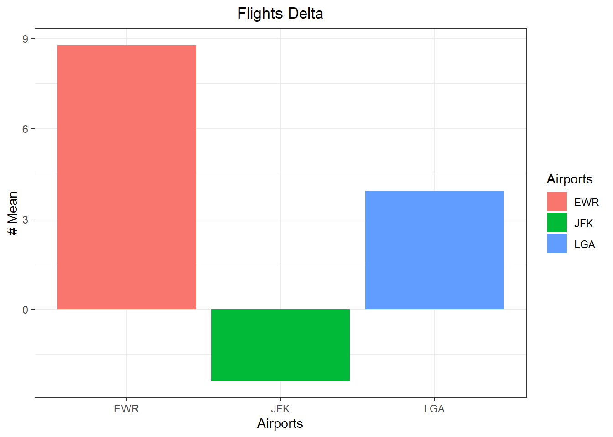
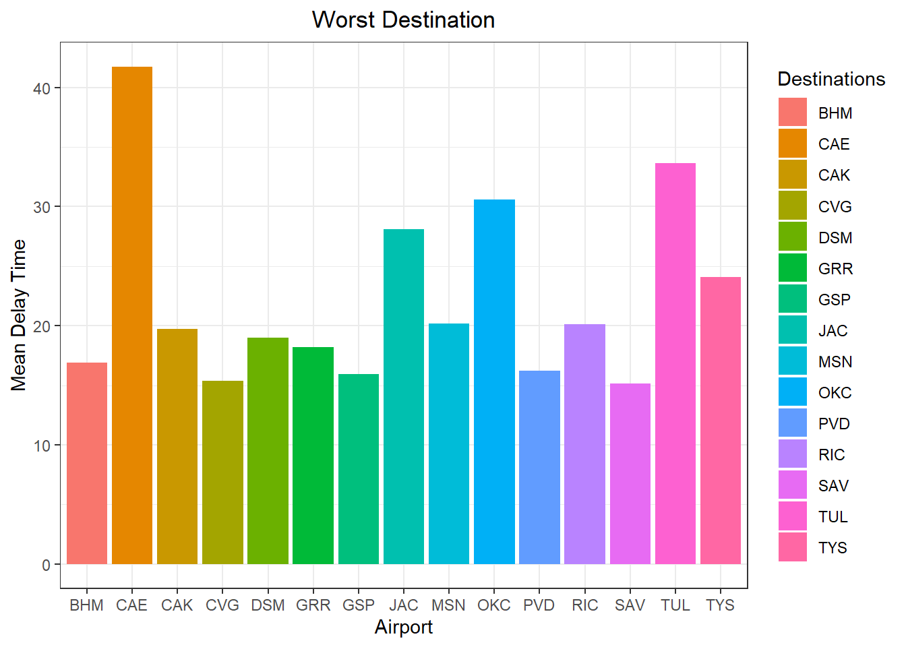

## Background
You just started your internship at a big firm in New York, and your manager gave you an extensive file of flights that departed JFK, LGA, or EWR in 2013. From this data (which you can obtain in R) your manager wants you to answer some specific questions.


## 2. Use a flights dataset


::: {.cell}

```{.r .cell-code}
# library tidyverse and nycflights13 installed
library(tidyverse)
library(nycflights13)
#install.packages('nycflights13')
```
:::


#### Checking the format of the data


::: {.cell}
::: {.cell-output .cell-output-stdout}
```
# A tibble: 5 × 19
   year month   day dep_time sched_dep_time dep_delay arr_time sched_arr_time
  <int> <int> <int>    <int>          <int>     <dbl>    <int>          <int>
1  2013     1     1      517            515         2      830            819
2  2013     1     1      533            529         4      850            830
3  2013     1     1      542            540         2      923            850
4  2013     1     1      544            545        -1     1004           1022
5  2013     1     1      554            600        -6      812            837
# ℹ 11 more variables: arr_delay <dbl>, carrier <chr>, flight <int>,
#   tailnum <chr>, origin <chr>, dest <chr>, air_time <dbl>, distance <dbl>,
#   hour <dbl>, minute <dbl>, time_hour <dttm>
```
:::

::: {.cell-output .cell-output-stdout}
```
tibble [336,776 × 19] (S3: tbl_df/tbl/data.frame)
 $ year          : int [1:336776] 2013 2013 2013 2013 2013 2013 2013 2013 2013 2013 ...
 $ month         : int [1:336776] 1 1 1 1 1 1 1 1 1 1 ...
 $ day           : int [1:336776] 1 1 1 1 1 1 1 1 1 1 ...
 $ dep_time      : int [1:336776] 517 533 542 544 554 554 555 557 557 558 ...
 $ sched_dep_time: int [1:336776] 515 529 540 545 600 558 600 600 600 600 ...
 $ dep_delay     : num [1:336776] 2 4 2 -1 -6 -4 -5 -3 -3 -2 ...
 $ arr_time      : int [1:336776] 830 850 923 1004 812 740 913 709 838 753 ...
 $ sched_arr_time: int [1:336776] 819 830 850 1022 837 728 854 723 846 745 ...
 $ arr_delay     : num [1:336776] 11 20 33 -18 -25 12 19 -14 -8 8 ...
 $ carrier       : chr [1:336776] "UA" "UA" "AA" "B6" ...
 $ flight        : int [1:336776] 1545 1714 1141 725 461 1696 507 5708 79 301 ...
 $ tailnum       : chr [1:336776] "N14228" "N24211" "N619AA" "N804JB" ...
 $ origin        : chr [1:336776] "EWR" "LGA" "JFK" "JFK" ...
 $ dest          : chr [1:336776] "IAH" "IAH" "MIA" "BQN" ...
 $ air_time      : num [1:336776] 227 227 160 183 116 150 158 53 140 138 ...
 $ distance      : num [1:336776] 1400 1416 1089 1576 762 ...
 $ hour          : num [1:336776] 5 5 5 5 6 5 6 6 6 6 ...
 $ minute        : num [1:336776] 15 29 40 45 0 58 0 0 0 0 ...
 $ time_hour     : POSIXct[1:336776], format: "2013-01-01 05:00:00" "2013-01-01 05:00:00" ...
```
:::
:::


## 3. Answering Questions

### For each origin airport (JFK, EWR, LGA), which airline has the lowest 75th percentile of departure delay for flights scheduled to leave earlier than noon?

Answer: US, EV and US, are located in the lowest 75% accordingly to the graph.


::: {.cell}
::: {.cell-output .cell-output-stdout}
```
# A tibble: 135,645 × 19
    year month   day dep_time sched_dep_time dep_delay arr_time sched_arr_time
   <int> <int> <int>    <int>          <int>     <dbl>    <int>          <int>
 1  2013     1     1      517            515         2      830            819
 2  2013     1     1      533            529         4      850            830
 3  2013     1     1      542            540         2      923            850
 4  2013     1     1      544            545        -1     1004           1022
 5  2013     1     1      554            600        -6      812            837
 6  2013     1     1      554            558        -4      740            728
 7  2013     1     1      555            600        -5      913            854
 8  2013     1     1      557            600        -3      709            723
 9  2013     1     1      557            600        -3      838            846
10  2013     1     1      558            600        -2      753            745
# ℹ 135,635 more rows
# ℹ 11 more variables: arr_delay <dbl>, carrier <chr>, flight <int>,
#   tailnum <chr>, origin <chr>, dest <chr>, air_time <dbl>, distance <dbl>,
#   hour <dbl>, minute <dbl>, time_hour <dttm>
```
:::

::: {.cell-output-display}
{width=672}
:::
:::

### Which origin airport is best to minimize my chances of a late arrival when I am using Delta Airlines?

Answer: Delta Airlines only have 3 airports of origin and JFK is the one with less late arrival determined by the average.


::: {.cell}
::: {.cell-output .cell-output-stdout}
```
# A tibble: 3 × 2
  origin arrival_mean
  <chr>         <dbl>
1 EWR            8.78
2 JFK           -2.38
3 LGA            3.93
```
:::

::: {.cell-output-display}
{width=672}
:::
:::


### Which destination airport is the worst airport for arrival delays? You decide on the metric for “worst.”

Answer: the worst destination airport in terms of arrival delays is CAE. I used a >15 mean value to describe worst.


::: {.cell}
::: {.cell-output .cell-output-stdout}
```
# A tibble: 15 × 2
   dest  arrival_mean
   <chr>        <dbl>
 1 CAE           41.8
 2 TUL           33.7
 3 OKC           30.6
 4 JAC           28.1
 5 TYS           24.1
 6 MSN           20.2
 7 RIC           20.1
 8 CAK           19.7
 9 DSM           19.0
10 GRR           18.2
11 BHM           16.9
12 PVD           16.2
13 GSP           15.9
14 CVG           15.4
15 SAV           15.1
```
:::

::: {.cell-output-display}
{width=672}
:::
:::


Disaggregated data by each airport (showing complexity of data)

::: {.cell}

```{.r .cell-code}
ggplot(df1, mapping = aes(x=factor(origin), y= dep_delay))+
  geom_dotplot(aes(fill=origin,color=origin),binaxis = "y", binwidth = 0.2,dotsize = 0.5)+
  theme(panel.grid.major = element_blank())+
  labs(title = "Airport Delays", x = "Airport", y="Departure Delay")+
  theme(plot.title = element_text(hjust = 0.5))
```

::: {.cell-output-display}
{width=672}
:::
:::
