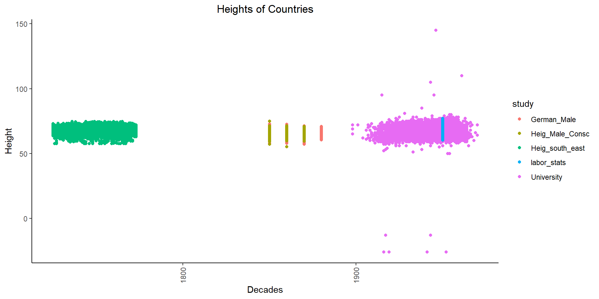

## Background 
The Scientific American argues that humans have been getting taller over the years. As the data scientists that we are becoming, we would like to find data that validates or refutes this concept. Our challenge is to show different male heights across the centuries.

This time, instead of looking at the mean height per country over time like we did for the previous task, we have a few files that contain heights of individuals. Each file represents a different time and/or place from which the individuals are sampled. We will combine the data from these files into one dataset to facilitate our visualization.


::: {.cell}

:::


## Step 1-3
Work with these datasets where each row represents an individual. Import these five datasets into R.

Downloading

::: {.cell}
::: {.cell-output .cell-output-stdout}
```
# A tibble: 7,277 × 4
   birth_year height.in height.cm study     
        <dbl>     <dbl>     <dbl> <chr>     
 1       1915        95      241. University
 2       1940        60      152. University
 3       1940        67      170. University
 4       1912        65      165. University
 5       1961        66      168. University
 6       1954        62      157. University
 7       1954        71      180. University
 8       1951        64      163. University
 9       1952        67      170. University
10       1951        69      175. University
# ℹ 7,267 more rows
```
:::

::: {.cell-output .cell-output-stdout}
```
tibble [27,888 × 4] (S3: tbl_df/tbl/data.frame)
 $ birth_year: num [1:27888] 1850 1850 1850 1850 1850 1850 1850 1850 1850 1850 ...
 $ height.in : num [1:27888] 66.8 61.6 67.9 66.2 65.6 63.1 63.2 63.9 63.7 67 ...
 $ height.cm : num [1:27888] 170 156 172 168 167 ...
 $ study     : chr [1:27888] "German_Male" "German_Male" "German_Male" "German_Male" ...
```
:::
:::

## Step 4 Short paragraph
In order to clean the data I follow the next steps:

1. Download each file
2. Assign each file to a variable
3. Work with each variable
    3.1 Understand the columns
    3.2 Locate the needed columns
    3.3 Rename columns
    3.4 Make calculations if needed
    3.5 Create new columns as needed
    3.6 Select just needed columns
4. Assign the work in step 3 to a new variable
5. Verify the columns of each variable (data frames)
6. Combine all variables in a single data frame.
I decided to exclude all the others columns because there were not relevant to the homework task. I think some of the columns can be useful to answers other questions thought.


## Step 5 Make a plot 

  

::: {.cell}
::: {.cell-output-display}
{width=960}
:::
:::

## Step 6 conclusions
The studies indeed reflect different conclusions. I do not see clear evidence that people is getting tall over time except for the Bureau of Labor Statistics Height data. It seems to me that this evidence goes in different directions than the previous study where you could cleary see a raising average over time. 

Just looking at the German male in green color and the Heights of bavarian in skin color, it seems that up to the 19 hundreds there is not changes in height at all. I wonder if did something wrong when cleaning the data beacuse it does not have much sense.

