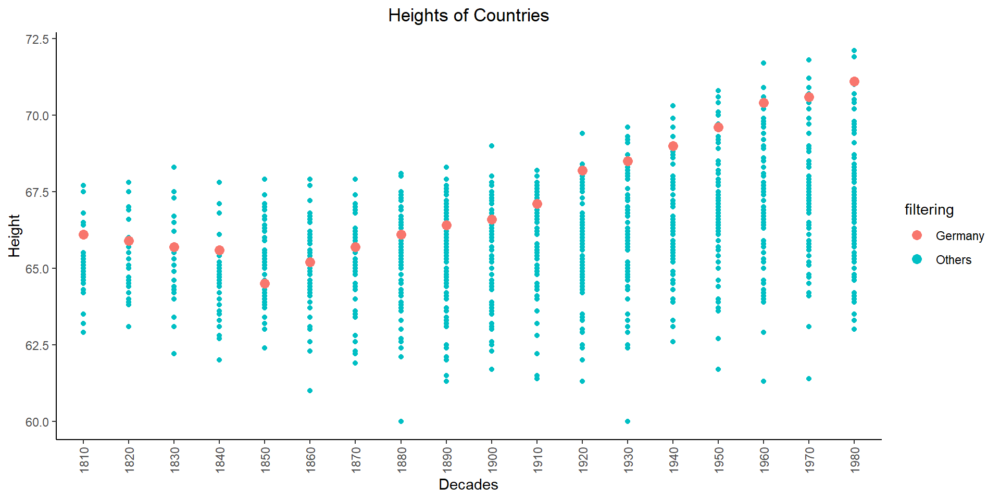

## Background 
The Scientific American argues that humans have been getting taller over the years. As the data scientists that we are becoming, we would like to find data that validates this concept.

This project is not as severe as the two quotes below, but it will give you a taste of pulling various data and file formats together into “tidy” data for visualization and analysis.


::: {.cell}

:::


## Step 1
Read in and tidy the Worldwide heights estimates .xlsx file. After tidying the data it should look something like this (this is just a snippet of a part of the dataset, yours will have more rows of course).

Downloading

::: {.cell}
::: {.cell-output .cell-output-stdout}
```
# A tibble: 100 × 4
   Code  country                                           height.cm year_decade
   <chr> <chr>                                                 <dbl> <chr>      
 1 56    Belgium                                                163. 1810       
 2 280   Federal Republic of Germany (until 1990)               168. 1810       
 3 250   France                                                 164. 1810       
 4 276   Germany                                                168. 1810       
 5 528   Netherlands                                            166  1810       
 6 246   Finland                                                172. 1810       
 7 372   Ireland                                                168  1810       
 8 578   Norway                                                 169. 1810       
 9 826   United Kingdom of Great Britain and Northern Ire…      170. 1810       
10 191   Croatia                                                163. 1810       
# ℹ 90 more rows
```
:::
:::

## Step 3
Make a plot fit for presentation, with decade on the x-axis and and all the countries’ heights in inches on the y-axis; with the points from Germany highlighted based on the data from the .xlsx file.

::: {.cell}
::: {.cell-output-display}
{width=960}
:::
:::

## Concluion
It´s some evidence that humans are getting taller. The spread through the years are getting bigger going upward. Germany, for example, shows that the height is increasing through the years.

