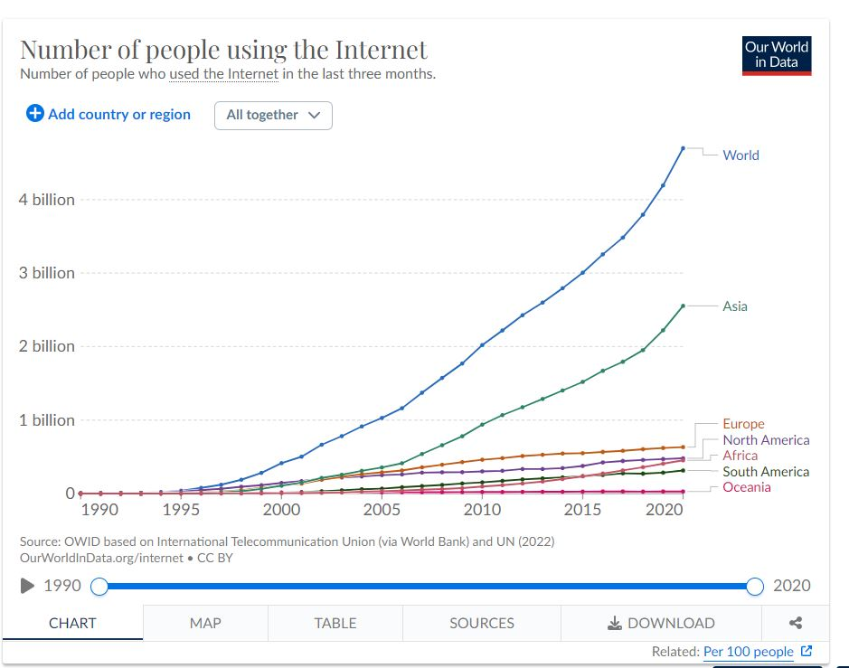

## Background

Review the Our World in Data webpage and find a graphic that interests you. Using the data from their website, spend a couple of hours recreating their graphic as closely as you can in an .qmd file . (Make sure you keep the link or can navigate back to the original chart on their website). Be sure to include a link to or a snapshop of the graphic you are trying to recreate in your .qmd file

## Load Packages


::: {.cell}

:::


## Step1

Recreate this graph as closely as you can. This will/should take the bulk of your time

Graph: 

https://ourworldindata.org/grapher/number-of-internet-users




::: {.cell}

```{.r .cell-code}
df <- read.csv("number-of-internet-users.csv", check.names=TRUE)

df1<- df%>%
  rename(users = Number.of.Internet.users)%>%
  fill(users, .direction = "downup")%>%
  filter(Entity=="World"| Entity=="Asia"| Entity=="Europe" | Entity=="North America" | Entity=="Africa" | Entity=="South America"| Entity=="Oceania")

head(df1,5)
```

::: {.cell-output .cell-output-stdout}
```
  Entity Code Year  users
1 Africa      1990      0
2 Africa      1991   5434
3 Africa      1992  16232
4 Africa      1993  48970
5 Africa      1994 112387
```
:::
:::


## Graph


::: {.cell}
::: {.cell-output-display}
{width=672}
:::
:::
