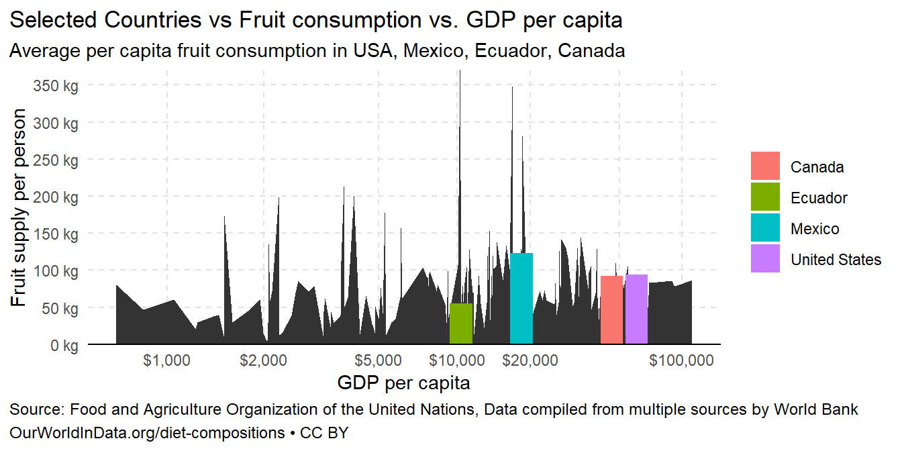

## Background
The Our World in Data website publishes research and graphics that provide insight into world data. We are going to recreate one of their charts and use it to practice our annotation skills.

If the thing you want to edit is not a theme element, then it is related to data and can mostly likely be changed inside a geom_() or a scale_() layer.

## Load Packages


::: {.cell}

:::

## Step1
Recreate this graph as closely as you can. This will/should take the bulk of your time

::: {.cell}

```{.r .cell-code}
df <- read_csv("fruit.csv")
head(df,5)
```

::: {.cell-output .cell-output-stdout}
```
# A tibble: 5 × 6
  Entity     Code   Year Fruit | 00002919 || …¹ GDP per capita, PPP …² Continent
  <chr>      <chr> <dbl>                  <dbl>                  <dbl> <chr>    
1 Abkhazia   OWID…  2015                   NA                       NA Asia     
2 Afghanist… AFG    1961                   41.9                     NA <NA>     
3 Afghanist… AFG    1962                   38.7                     NA <NA>     
4 Afghanist… AFG    1963                   39.0                     NA <NA>     
5 Afghanist… AFG    1964                   48.9                     NA <NA>     
# ℹ abbreviated names:
#   ¹​`Fruit | 00002919 || Food available for consumption | 0645pc || kilograms per year per capita`,
#   ²​`GDP per capita, PPP (constant 2017 international $)`
```
:::

```{.r .cell-code}
df <- rename(df,fruit_pp = `Fruit | 00002919 || Food available for consumption | 0645pc || kilograms per year per capita`, 
         gdp_per_cap = `GDP per capita, PPP (constant 2017 international $)`,
         entity = Entity,
         code = Code,
         year = Year,
         continent = Continent)

# fill in missing values and do some filtering
data_2020 <- df |> 
  group_by(entity) |> 
    fill(continent, .direction = "downup") |> # fills in missing values in the continent column within each entity using the value(s) present in continent.
  ungroup() |> 
  filter(!is.na(continent)) |> # Non countries (continents and other country groups) don't have a continent value. Remove them.
  filter(year == 2020) # focus on year 2020 to match the visual on the webpage.

head(data_2020,5)
```

::: {.cell-output .cell-output-stdout}
```
# A tibble: 5 × 6
  entity              code   year fruit_pp gdp_per_cap continent    
  <chr>               <chr> <dbl>    <dbl>       <dbl> <chr>        
1 Afghanistan         AFG    2020     35.4       1968. Asia         
2 Albania             ALB    2020    191.       13256. Europe       
3 Algeria             DZA    2020    105.       10845. Africa       
4 Angola              AGO    2020     67.5       6032. Africa       
5 Antigua and Barbuda ATG    2020    126.       18276. North America
```
:::

```{.r .cell-code}
#colnames(data_2020)
#str(df)
```
:::

## Graph

::: {.cell}
::: {.cell-output-display}
{width=672}
:::
:::

##Graph2


::: {.cell}
::: {.cell-output-display}
{width=672}
:::
:::

### graph 3


::: {.cell}

```{.r .cell-code}
data3 <- data_2020 %>% 
  filter(continent %in% c('North America'))

ggplot(data = data_2020, aes(x=log(gdp_per_cap), y = fruit_pp)) +
  geom_point(alpha = 0.5) +
  geom_point(data = data3, aes(x = log(gdp_per_cap), y = fruit_pp, color = continent), alpha = 1, size = 3) +
  labs(y='Fruit supply per person', x = 'GDP per capita', title = 'Fruit consumption vs. GDP per capita, 2020', subtitle = 'Average per capita fruit consumption, measured in kilograms per year \nversus gross domestic product (GDP)', caption = 'Source: Food and Agriculture Organization of the United Nations, 
Data compiled from multiple sources by World Bank

OurWorldInData.org/diet-compositions • CC BY') 
```

::: {.cell-output-display}
{width=672}
:::
:::


## Summarizing
This is one of the longest projects I have worked. I have learn several commands such as:

   plot.caption = element_text()
    plot.caption.position = "plot"
    plot.title.position ="plot"
    plot.title = element_text(2),
    legend.text = element_text(),
    legend.justification = "top",
    plot.subtitle = element_text(),
    axis.text = element_text(),
    axis.text.x = element_text(),
    axis.text.y = element_text(),
    panel.border = element_blank(),
    axis.line.y = element_blank(),
    axis.ticks =element_blank()

Basically, I learned that there is a command to customize any part of the graph. When I do not know how google is a great tool to search for examples. 
Highlighting is also an important tool. I learned that manipulating the colors, shapes, and sizes is a great way to attract the reader´s eye. 
