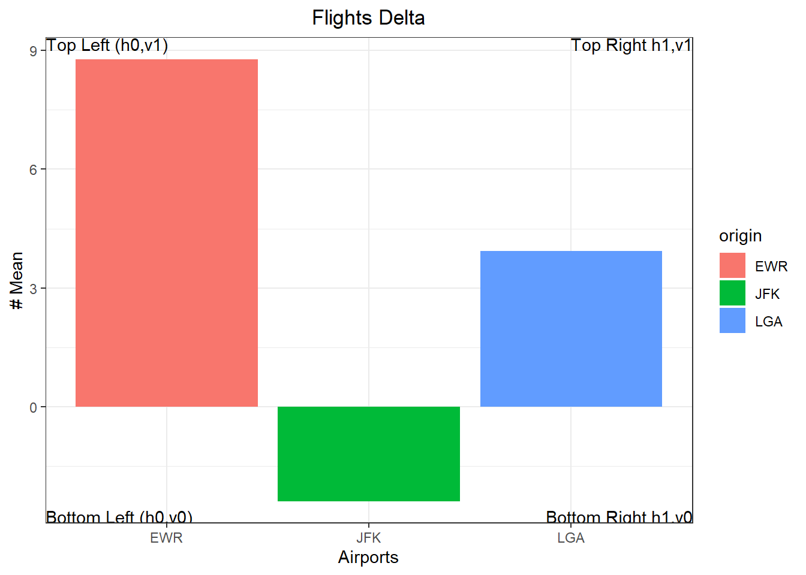
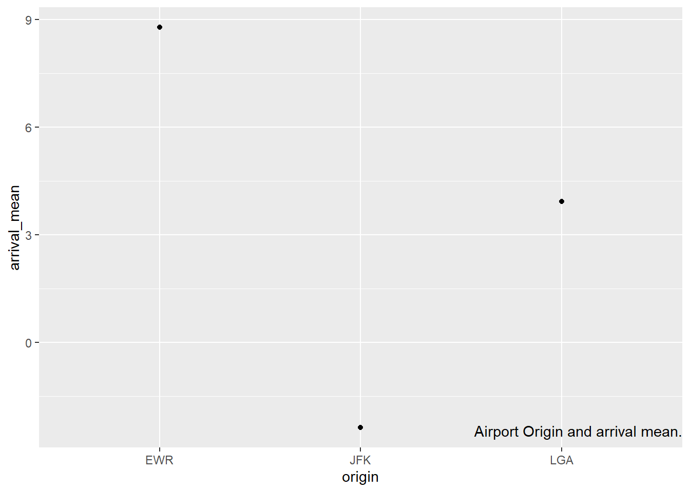
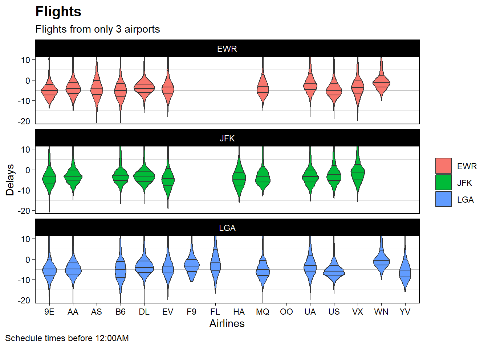

## Background
Your boss/client really liked the work you did previously in Reducing Gun Deaths and/or Wings to Fly. They want to use the graphic in a presentation they will be making at a keynote address for a professional conference. You will need to return to that work and polish the graph for presentation.

With your ever increasing understanding of visualization and programming, improve the graph that was previously turned in.

## Load Packages


::: {.cell}

:::

## Step1

Attempt at least 2 of the book exercises in section 28.3.1:
Use geom_text() to place text at the four corners of the plot.

::: {.cell}

```{.r .cell-code}
df2 <- filter(flights,carrier=="DL")%>%
  group_by(origin) %>%
  summarize(arrival_mean= mean(arr_delay, na.rm= TRUE))

annotations <- data.frame(
        xpos = c(-Inf,-Inf,Inf,Inf),
        ypos =  c(-Inf, Inf,-Inf,Inf),
        annotateText = c("Bottom Left (h0,v0)","Top Left (h0,v1)"
                        ,"Bottom Right h1,v0","Top Right h1,v1"),
        hjustvar = c(0,0,1,1) ,
        vjustvar = c(0,1,0,1)) #<- adjust


ggplot(data = df2)+
  geom_col(mapping = aes(x=origin,y=arrival_mean, fill = origin))+
  theme_bw()+
  ylab("# Mean")+
  xlab("Airports")+
  ggtitle("Flights Delta")+ theme(plot.title = element_text(hjust = 0.5))+ # title+
  geom_text(data=annotations,aes(x=xpos,y=ypos,hjust=hjustvar,vjust=vjustvar,label=annotateText))
```

::: {.cell-output-display}
{width=672}
:::
:::

Read the documentation for annotate(). How can you use it to add a text label to a plot without having to create a tibble?


::: {.cell}

```{.r .cell-code}
# Use this R-Chunk to clean & wrangle your data.

ggplot(df2, aes(x=origin,y=arrival_mean)) +
  geom_point() +
  annotate("text",
    x = Inf, y = -Inf,
    label = "Airport Origin and arrival mean.", vjust = -1, hjust = "right"
  )
```

::: {.cell-output-display}
{width=672}
:::
:::

 What are the four arguments to arrow()

1. Angle: Angle of arrow head
2. Length: Length of the arrow head
3. Ends: Ends of the line to draw arrow head
4. Type: Whether the arrow head is a closed or open triangle

## Step2 Revisit the assigment


::: {.cell}

```{.r .cell-code}
#| label: picking variables 1
#| echo: false
#| #| fig-width: 8
#| fig-height: 15
df1= filter(flights,origin=="JFK"| origin=="EWR"| origin=="LGA", sched_dep_time<=1200)
head(df1,10)
```

::: {.cell-output .cell-output-stdout}
```
# A tibble: 10 × 19
    year month   day dep_time sched_dep_time dep_delay arr_time sched_arr_time
   <int> <int> <int>    <int>          <int>     <dbl>    <int>          <int>
 1  2013     1     1      517            515         2      830            819
 2  2013     1     1      533            529         4      850            830
 3  2013     1     1      542            540         2      923            850
 4  2013     1     1      544            545        -1     1004           1022
 5  2013     1     1      554            600        -6      812            837
 6  2013     1     1      554            558        -4      740            728
 7  2013     1     1      555            600        -5      913            854
 8  2013     1     1      557            600        -3      709            723
 9  2013     1     1      557            600        -3      838            846
10  2013     1     1      558            600        -2      753            745
# ℹ 11 more variables: arr_delay <dbl>, carrier <chr>, flight <int>,
#   tailnum <chr>, origin <chr>, dest <chr>, air_time <dbl>, distance <dbl>,
#   hour <dbl>, minute <dbl>, time_hour <dttm>
```
:::

```{.r .cell-code}
ggplot(data = df1)+
  geom_violin(mapping = aes(x=carrier, y=dep_delay, fill=origin),draw_quantiles = c(0.25, 0.5, 0.75))+
  theme_linedraw()+
  coord_cartesian(ylim = c(-20, 10)) +
  facet_wrap(~ origin, nrow = 3)+
  labs(title = "Flights", y = "Delays", x = "Airlines",
        subtitle="Flights from only 3 airports",
        caption ="Schedule times before 12:00AM")+
  
  theme(
      plot.caption = element_text(color="black", hjust=0, size=9, lineheight = 1.2),
      plot.caption.position = "plot",
      legend.position =  "right",
      legend.title = element_blank(),
      panel.grid.major.y = element_blank(),
      panel.grid.major.x = element_blank(),
      panel.grid = element_line(color = "gray"),
      plot.title = element_text(face="bold", color="black", hjust=0, size=15, lineheight = 1.2))
```

::: {.cell-output-display}
{width=672}
:::
:::
