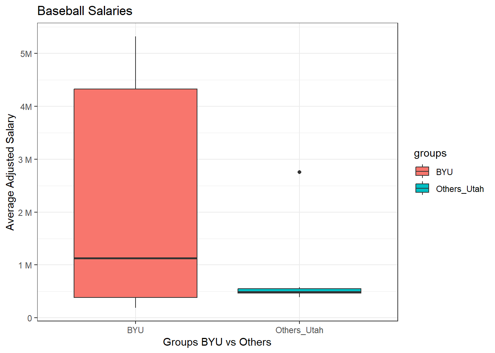
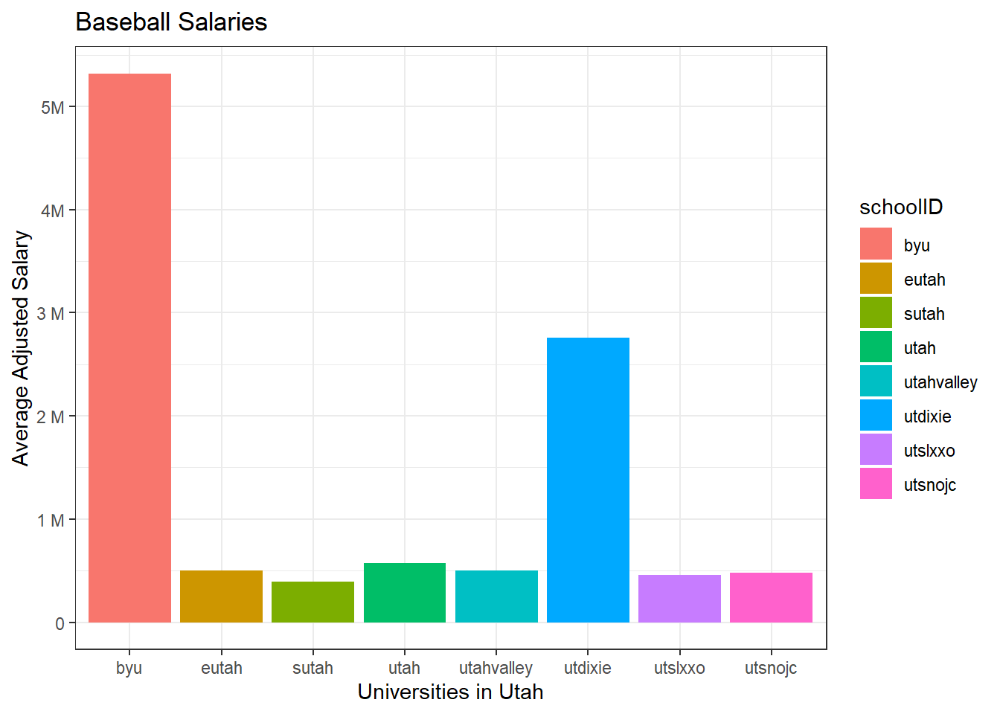
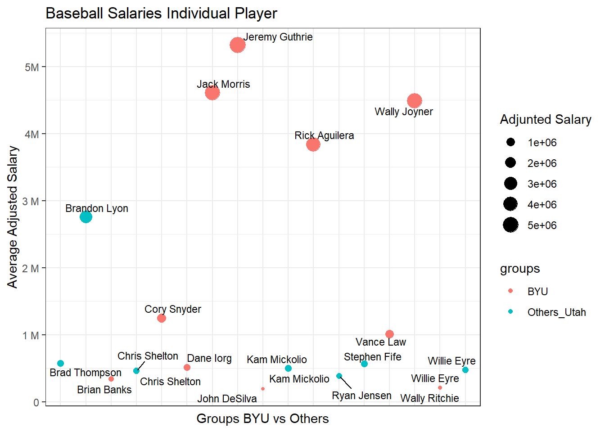

## 1. Background

Over the campfire, you and a friend get into a debate about which college in Utah has had the best MLB success. As an avid BYU fan, you want to prove your point, and you go to data to settle the debate. You need a clear visualization that depicts the performance of BYU players compared to other Utah college players that have played in the major leagues. The library(Lahman) package has a comprehensive set of baseball data. It is great for testing out our relational data skills. We will also need a function to adjust player salaries due to inflation- library(priceR).

## 2. Load Packages


::: {.cell}

```{.r .cell-code}
library(tidyverse)
library(Lahman)
library(priceR)
```
:::


## Exploring packages


::: {.cell}
::: {.cell-output .cell-output-stdout}
```
Generating URL to request all 297 results
Retrieving inflation data for US 
Generating URL to request all 63 results
```
:::

::: {.cell-output-display}
{width=672}
:::
:::

::: {.cell}

```{.r .cell-code}
ggplot(data = dfutah)+
  geom_col(aes(x=schoolID, y=ave_adj_salary, fill=schoolID), 
            position='dodge', stat='summary', fun='mean')+
  labs(title = "Baseball Salaries", y = "Average Adjusted Salary", x = "Universities in Utah")+
  scale_y_continuous(breaks =seq(0,7e06, by=1e6), 
                 labels = c("0","1 M","2 M", "3 M", "4M", "5M", "6M","7M"))+
  theme_bw()
```

::: {.cell-output-display}
{width=672}
:::
:::

::: {.cell}

```{.r .cell-code}
library(ggrepel)

dfutah1 <-dfutah%>%
  inner_join(player,by="playerID")

dfutah1<- dfutah1%>%   
  mutate(full_name = paste(nameFirst, nameLast, sep = " "))

p<-ggplot(data=dfutah1)+
  geom_point(aes(x=full_name, y=ave_adj_salary, color=groups, size=ave_adj_salary))+
   labs(title = "Baseball Salaries Individual Player", y = "Average Adjusted Salary", x = "Groups BYU vs Others")+
   theme(plot.title = element_text(hjust = 0.5))+
  geom_text_repel(aes(x=full_name, y=ave_adj_salary,label = full_name),size = 3) +
 
  scale_y_continuous(breaks =seq(0,7e06, by=1e6), 
                 labels = c("0","1 M","2 M", "3 M", "4M", "5M", "6M","7M"))+
  theme_bw()

p+  theme (axis.text.x = element_blank(),
           axis.ticks.x = element_blank(),
            )+
  labs(size="Adjunted Salary")
```

::: {.cell-output-display}
{width=672}
:::
:::

## Conclusions
The data shows that BYU alummi by far exceeds the amount of money other students gain in their careers. In the box plot, even the median salary is more than the rest of the universities combined in Utah. In addition, the second graph shows that the second school in salary average is Dixie university. Anyway, it is half of the total average salary for BYU alumni.

