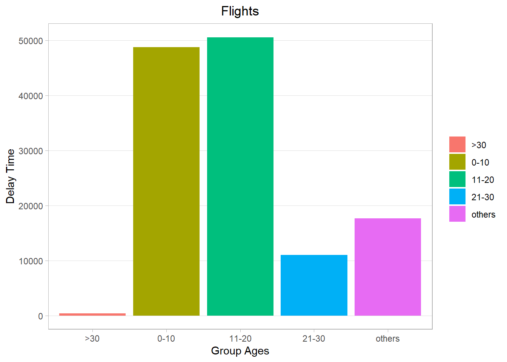
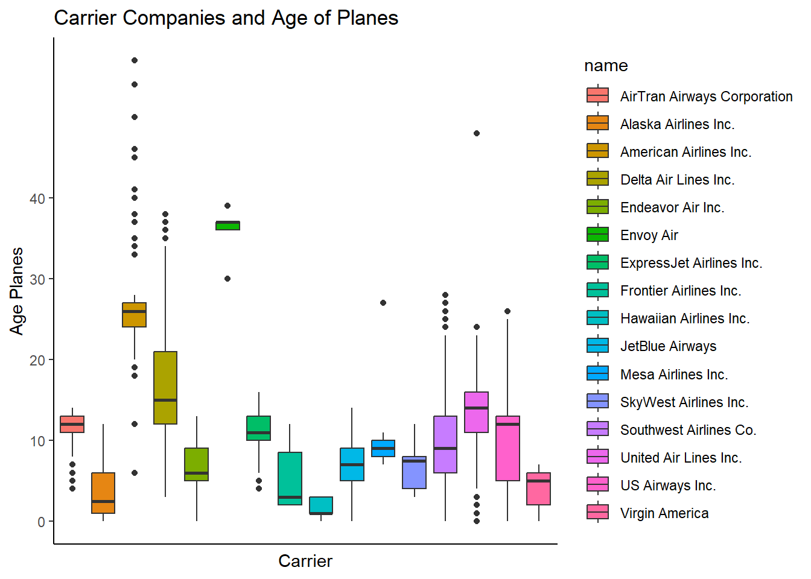
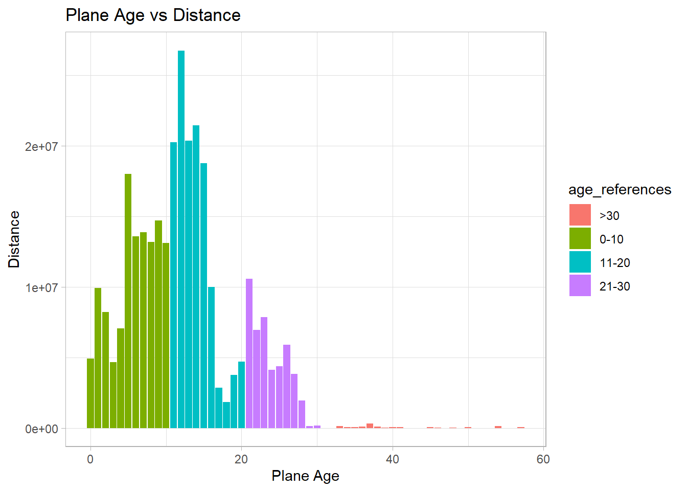

## 1. Background

In a previous task we used the flights tibble from the nycflights13 package to answer questions about flight delays. That same package contains four other tibbles that are related to flights and can help us answer more complex questions. Run data(package = "nycflights13") to see a list of the tibbles with a brief description.

For this task we are trying to answer two questions:

1. What is the relationship between departure delays and age of the plane? 
2. What is the relationship between airline carrier and age of the plane?

## 2. Use a flights dataset


::: {.cell}

```{.r .cell-code}
# library tidyverse and nycflights13 installed
library(tidyverse)
library(nycflights13)
#install.packages('nycflights13')
#data(package = "nycflights13")
```
:::


#### Example of the first rows of the data


::: {.cell}
::: {.cell-output .cell-output-stdout}
```
tibble [336,776 × 19] (S3: tbl_df/tbl/data.frame)
 $ year          : int [1:336776] 2013 2013 2013 2013 2013 2013 2013 2013 2013 2013 ...
 $ month         : int [1:336776] 1 1 1 1 1 1 1 1 1 1 ...
 $ day           : int [1:336776] 1 1 1 1 1 1 1 1 1 1 ...
 $ dep_time      : int [1:336776] 517 533 542 544 554 554 555 557 557 558 ...
 $ sched_dep_time: int [1:336776] 515 529 540 545 600 558 600 600 600 600 ...
 $ dep_delay     : num [1:336776] 2 4 2 -1 -6 -4 -5 -3 -3 -2 ...
 $ arr_time      : int [1:336776] 830 850 923 1004 812 740 913 709 838 753 ...
 $ sched_arr_time: int [1:336776] 819 830 850 1022 837 728 854 723 846 745 ...
 $ arr_delay     : num [1:336776] 11 20 33 -18 -25 12 19 -14 -8 8 ...
 $ carrier       : chr [1:336776] "UA" "UA" "AA" "B6" ...
 $ flight        : int [1:336776] 1545 1714 1141 725 461 1696 507 5708 79 301 ...
 $ tailnum       : chr [1:336776] "N14228" "N24211" "N619AA" "N804JB" ...
 $ origin        : chr [1:336776] "EWR" "LGA" "JFK" "JFK" ...
 $ dest          : chr [1:336776] "IAH" "IAH" "MIA" "BQN" ...
 $ air_time      : num [1:336776] 227 227 160 183 116 150 158 53 140 138 ...
 $ distance      : num [1:336776] 1400 1416 1089 1576 762 ...
 $ hour          : num [1:336776] 5 5 5 5 6 5 6 6 6 6 ...
 $ minute        : num [1:336776] 15 29 40 45 0 58 0 0 0 0 ...
 $ time_hour     : POSIXct[1:336776], format: "2013-01-01 05:00:00" "2013-01-01 05:00:00" ...
```
:::

::: {.cell-output .cell-output-stdout}
```
tibble [3,322 × 9] (S3: tbl_df/tbl/data.frame)
 $ tailnum     : chr [1:3322] "N10156" "N102UW" "N103US" "N104UW" ...
 $ year        : int [1:3322] 2004 1998 1999 1999 2002 1999 1999 1999 1999 1999 ...
 $ type        : chr [1:3322] "Fixed wing multi engine" "Fixed wing multi engine" "Fixed wing multi engine" "Fixed wing multi engine" ...
 $ manufacturer: chr [1:3322] "EMBRAER" "AIRBUS INDUSTRIE" "AIRBUS INDUSTRIE" "AIRBUS INDUSTRIE" ...
 $ model       : chr [1:3322] "EMB-145XR" "A320-214" "A320-214" "A320-214" ...
 $ engines     : int [1:3322] 2 2 2 2 2 2 2 2 2 2 ...
 $ seats       : int [1:3322] 55 182 182 182 55 182 182 182 182 182 ...
 $ speed       : int [1:3322] NA NA NA NA NA NA NA NA NA NA ...
 $ engine      : chr [1:3322] "Turbo-fan" "Turbo-fan" "Turbo-fan" "Turbo-fan" ...
```
:::
:::

::: {.cell}

:::


## Chart
Create a chart that looks at the distribution of departure delays by age (or age group). Do you notice any patterns?
Create a new column that groups age into 0-10, 11-20, 21-30, and >30


::: {.cell}
::: {.cell-output-display}
{width=672}
:::
:::


## Create a chart that looks at the distribution of age by carrier.


::: {.cell}
::: {.cell-output-display}
{width=672}
:::
:::

I see that most of the planes are fairly new between 1 to 15 years. It is interesting that among all carrier there is not a standard for replacing airplanes, which I see this in the distribution of the boxplot.

## Other graph 


::: {.cell}

```{.r .cell-code}
table2 <- select(chart_1, age,age_references,creation_year, dept_year, dep_delay,distance)
sum2 <- table2%>%
group_by(age_references)%>%
 summarise(tot_delays = sum(dep_delay > 0, na.rm = TRUE),
           distance = sum(distance> 0, na.rm = TRUE)
           ) 

ggplot(table2, aes(x = age, y = distance, fill=age_references)) +
  theme_light()+
  geom_bar(stat = "identity")+
  scale_y_continuous(breaks =seq(0,4e7, by=1e7))+
  labs(title = "Plane Age vs Distance", y = "Distance", x = "Plane Age")
```

::: {.cell-output-display}
{width=672}
:::
:::

The graph represent the planes by age and the flight distances. I would say that there are some old planes greater than 20 year with less distance flown. It may be that they were under utilize. It will be interesting to cross references with the cost of expenses.
