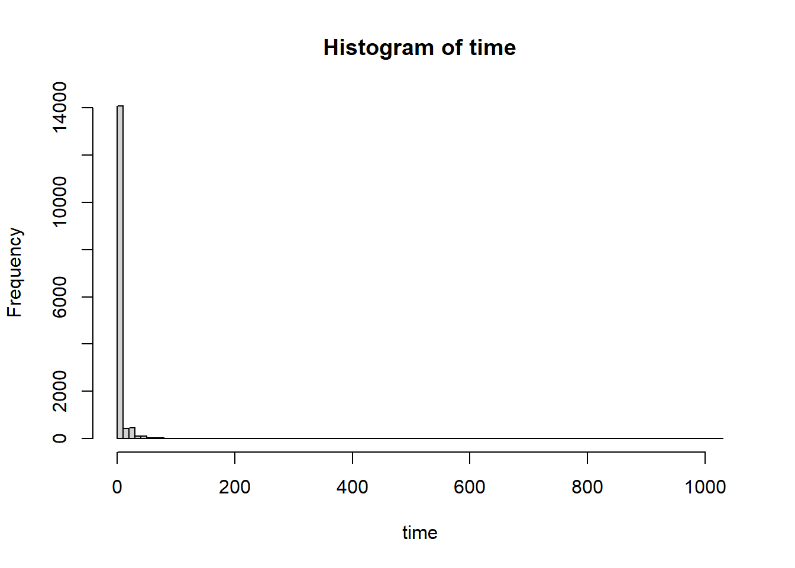
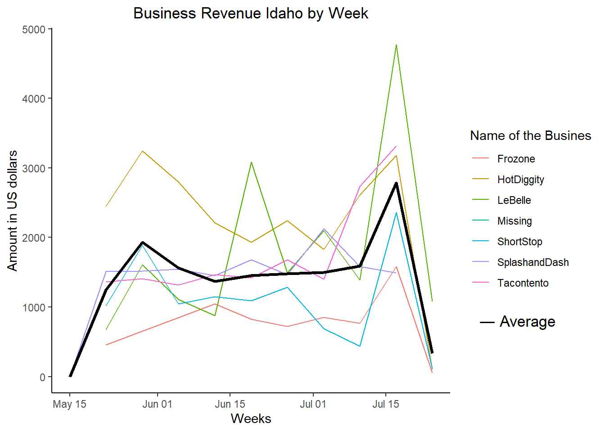
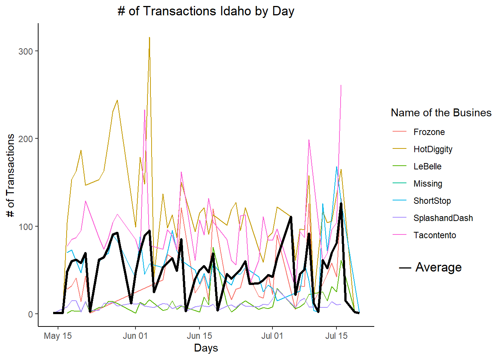
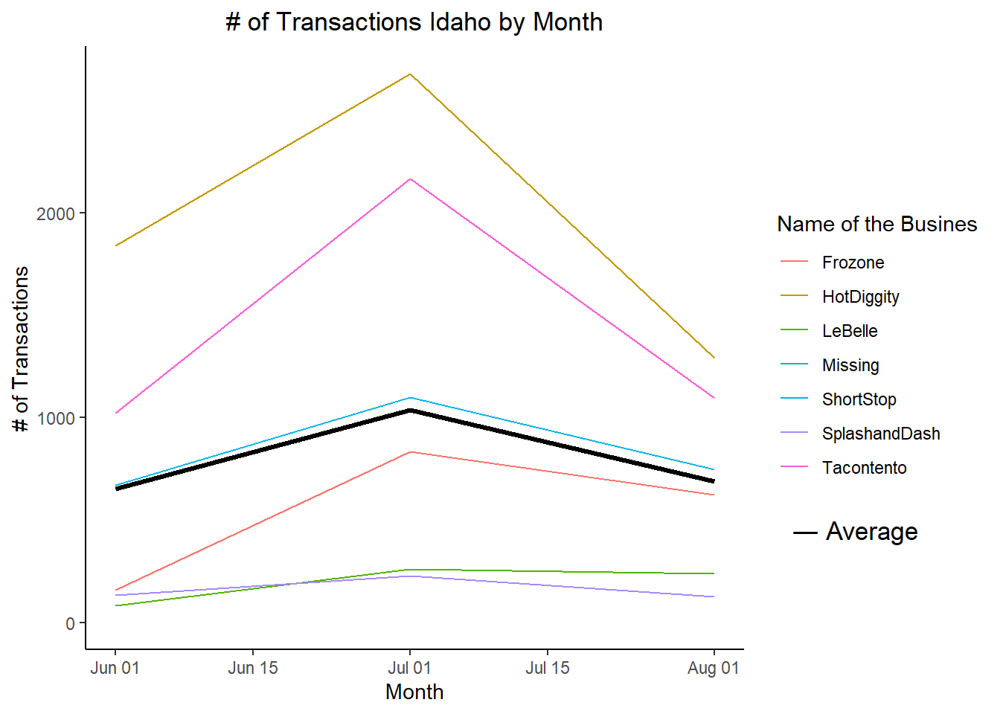
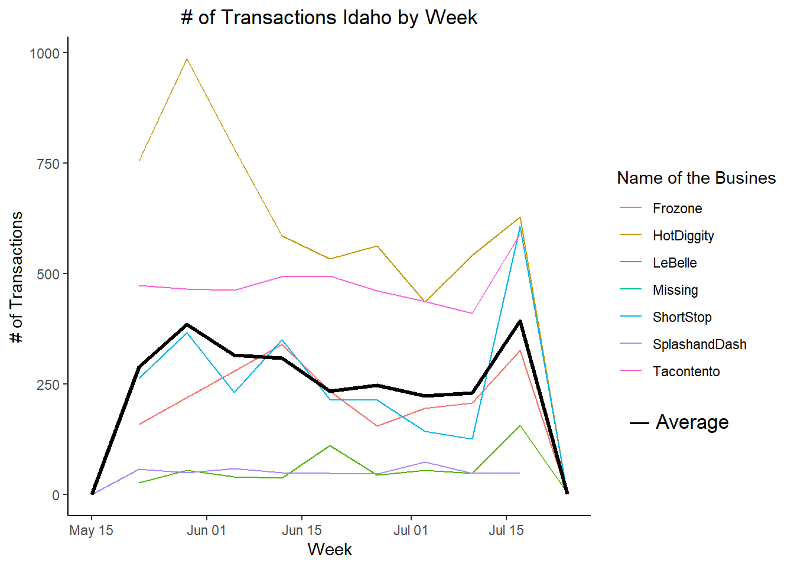

## 1. Background

We have transaction data for a few Rexburg, Idaho businesses that have been in operation for three months. Each of these companies has come to your investment company for a loan to expand their business. Your boss has asked you to go through the transactions for each business and provide daily, weekly, and monthly gross revenue summaries and comparisons.

A strong customer base is preferred over companies whose revenue comes from just a few big purchases/customers. Thus, customer traffic (number of transactions) will also be helpful in deciding which company to choose.

Your boss would like a short write-up with tables and visualizations that help with the decision of which company did the best over the three-month period. You will also need to provide a short paragraph with your recommendation after building your analysis.

This course only looks at understanding and visualizing recorded time series data. If you would like to learn more about forecasting I would recommend Forecasting: Principles and Practice and for a quick introduction read Exploring and Visualizing Time Series.

<https://otexts.com/fpp2/simple-methods.html>

## 2. Load Packages


::: {.cell}

```{.r .cell-code}
library(tidyverse)
library(lubridate)
library(downloader)
```
:::


## Read and clean in the data 
From https://byuistats.github.io/M335/data/sales.csv and format it for visualization and analysis.


::: {.cell}
::: {.cell-output .cell-output-stdout}
```
     Name               Type               Time               Amount        
 Length:15656       Length:15656       Length:15656       Min.   :-194.500  
 Class :character   Class :character   Class :character   1st Qu.:   2.500  
 Mode  :character   Mode  :character   Mode  :character   Median :   3.000  
                                                          Mean   :   5.294  
                                                          3rd Qu.:   4.500  
                                                          Max.   :1026.000  
```
:::

::: {.cell-output .cell-output-stdout}
```
'data.frame':	15656 obs. of  4 variables:
 $ Name  : chr  "Tacontento" "Tacontento" "Tacontento" "Tacontento" ...
 $ Type  : chr  "Food(prepared)" "Food(prepared)" "Food(prepared)" "Food(prepared)" ...
 $ Time  : chr  "2016-05-16T19:01:00Z" "2016-05-16T19:01:00Z" "2016-05-16T19:04:00Z" "2016-05-16T19:04:00Z" ...
 $ Amount: num  3 1.5 3 3 1.5 1 3 3 1.5 3 ...
```
:::

::: {.cell-output-display}
{width=672}
:::

::: {.cell-output .cell-output-stdout}
```
integer(0)
```
:::

::: {.cell-output .cell-output-stdout}
```
[1] 0
```
:::

::: {.cell-output .cell-output-stdout}
```
  Name   Type   Time Amount 
     0      0      0     17 
```
:::

::: {.cell-output-display}
{width=672}
:::
:::


## Groups Daily, Weekly, Montly
In a .qmd file create visualizations that show gross revenue over time for each company.
Consider whether to aggregate at the daily, the weekly, or monthly level - or all 3

::: {.cell}

:::


## Gross Revenue over time


::: {.cell}
::: {.cell-output-display}
{width=672}
:::

::: {.cell-output-display}
{width=672}
:::

::: {.cell-output-display}
{width=672}
:::
:::

## Customer Traffic 
Consider whether to aggregate at the daily, the weekly, or monthly level - or all 3


::: {.cell}

```{.r .cell-code}
 #| echo: false      
    
p<- ggplot(data = df2_day)+
  geom_line(aes(x=group_day,y=Trasaction_N, color=Name))+
  stat_summary(aes(x=group_day,y=Trasaction_N,colour="mean",group=1), fun.y=mean, geom="line", colour="black",linetype = "solid", size = 1.1)+
  theme_classic()+
  ylab("# of Transactions")+
  xlab("Days")+
  ggtitle("# of Transactions Idaho by Day")+ theme(plot.title = element_text(hjust = 0.5))+
guides(color=guide_legend("Name of the Busines"))
  
p+ labs(tag = " ― Average")+
  coord_cartesian(clip = "off") +
  theme(plot.tag.position = c(.86, .25))
```

::: {.cell-output-display}
{width=672}
:::

```{.r .cell-code}
p1<-ggplot(data = df2_month)+
  geom_line(aes(x=group_month,y=Trasaction_N, color=Name))+
  stat_summary(aes(x=group_month,y=Trasaction_N,colour="mean",group=1), fun.y=mean, geom="line", colour="black",linetype = "solid", size = 1.1)+
  theme_classic()+
  ylab("# of Transactions")+
  xlab("Month")+
  ggtitle("# of Transactions Idaho by Month")+ theme(plot.title = element_text(hjust = 0.5))+
guides(color=guide_legend("Name of the Busines"))
  
p1+ labs(tag = " ― Average")+
  coord_cartesian(clip = "off") +
  theme(plot.tag.position = c(.86, .25))
```

::: {.cell-output-display}
{width=672}
:::

```{.r .cell-code}
p2<-ggplot(data = df2_week)+
  geom_line(aes(x= group_week, y=Trasaction_N, color=Name))+
  stat_summary(aes(x=group_week, y=Trasaction_N, colour="mean",group=1), fun.y=mean, geom="line", colour="black",linetype = "solid", size = 1.1)+
  theme_classic()+
  ylab("# of Transactions")+
  xlab("Week")+
  ggtitle("# of Transactions Idaho by Week")+ theme(plot.title = element_text(hjust = 0.5))+
guides(color=guide_legend("Name of the Busines"))
  
p2+ labs(tag = " ― Average")+
  coord_cartesian(clip = "off") +
  theme(plot.tag.position = c(.86, .25))
```

::: {.cell-output-display}
{width=672}
:::
:::

## Hours by company
Provide a visualization that gives insight into hours of operation for each company.


::: {.cell}

```{.r .cell-code}
 #| echo: false  

df2<- mutate(df1, group_hour= ceiling_date(time_MST, "hour"))
df2<-df2 %>%
    group_by(group_hour,Name)%>%
    summarize(Trasaction_N = n(),
              amount = sum(Amount),
              average=mean(Amount))
df2$hours <- format(df2$group_hour,"%H:%M:%S")

ggplot(data=df2)+
  geom_point(aes(x=hours, y=amount, size=average, color=Name))+
 theme_classic()+
  ylab("# of Transactions ")+
  xlab("Hours of the Day")+
  ggtitle("# of Transactions Idaho by Hour")+ theme(plot.title = element_text(hjust = 0.5))+
  labs(color="Business Name")+
  guides(size="none")+
  theme(axis.text.x = element_text(angle = 90, vjust = 0.5, hjust=1)
)        
```

::: {.cell-output-display}
{width=672}
:::
:::


## Conclusions
Which company do you think performed the best over the three months? Why?

The best performing company is HotDiggity in terms of revenue by month looking at that graph. Of course, we do not the expenses and so we do not have the net income or profit margin to compare each company. This is just looking at this basic observation.

It it interesting to see that tacotento has trasaction with the highest level of revenue at 14:00 hours. Maybe it is because people love taco for lunch, but overall Tacotento is just above average. 

Speaking about operation, it is clear that most of the operation happens between 10-3pm and 5 to 9 where those companies need to have workers. It would be interesting to see if those business are close together. If so, they may compete for the same workers and maybe they have to offer additional benefit or pay. Further research will be needed. 
