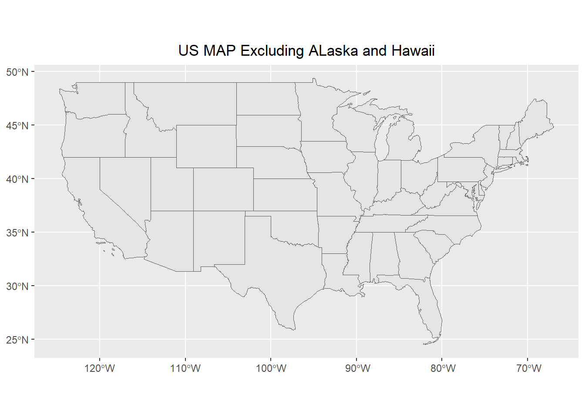
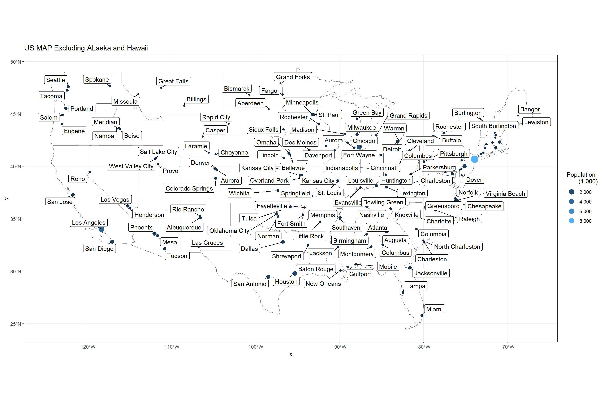

## Background

Up to this point, we have dealt with data that fits into the tidy format without much effort. Spatial data has many complicating factors that have made handling spatial data in R complicated.

We will use library(USAboundaries) and library(sf) to make a map of the US and show the top three largest cities in each state. Specifically, you will use library(ggplot2) and the function geom_sf() to recreate the provided image.

We want to create a map of the United States that plots the three largest cities (according to population) in each state - colored according to their rank. We also want to draw the shapes of the Idaho counties on the same plot.

### Loading Packages


::: {.cell}

```{.r .cell-code}
# Use this R-Chunk to load the libraries you will use in this file.
library(tidyverse)
library(ggplot2)
library(ggrepel)
library(USAboundaries)
library(lubridate)
library(sf)
library(dplyr)
library(ggforce)
#install.packages("USAboundariesData", repos = "https://ropensci.r-universe.dev", type = "source")
```
:::


## Process
### Step1
Create a map of the 48 continuous United States where each state is outlined and where the counties of Idaho are outlined. Here are some hints to keep in mind for this task.

1. From library(USAboundaries) use us_states() and us_counties() to get the state and county shape geometries

2. Remember that R has some helpful variables called state.name and state.abb

::: {.cell}

```{.r .cell-code}
states <-  (states <- us_states())

states <- states %>% 
  filter(state_name %in% state.name,
         state_name != "Hawaii",
         state_name != "Alaska")


ggplot(data=states)+
  geom_sf(aes(group = state_name))+
  labs(title = "US MAP Excluding ALaska and Hawaii")+
  theme(plot.title = element_text(hjust = 0.5))
```

::: {.cell-output-display}
{width=672}
:::
:::

## TOP 3 cities

Create a dataset that only contains rows for the top 3 cities in each of the 48 continuous states and has a column that contains their ranking (either a 1, 2, or 3).

::: {.cell}

```{.r .cell-code}
cities <- cities <- us_cities()

rankcities<-cities %>% arrange(state_name,desc(population)) %>%
    group_by(state_name) %>%
    mutate(rank = rank(desc(population)))

rankcities<-filter(rankcities,rank==1| rank==2| rank==3)

rankcities <- rankcities %>% 
  filter(state_name %in% state.name,
         state_name != "Hawaii",
         state_name != "Alaska")

p<- ggplot(data=states)+
  geom_sf(aes(group = state_name),fill = NA)+
  geom_sf(data=rankcities,aes( color=population, size=population))+
  labs(title = "US MAP Excluding ALaska and Hawaii")+
  theme_bw()+
  guides(color = guide_legend( 
                override.aes=list(shape = 16, size=4)))+
  scale_color_continuous(labels = scales::unit_format(unit = "", scale = 1e-3))+
  ggrepel::geom_label_repel(
    data = rankcities,
    aes(label = city, geometry = geometry),
    stat = "sf_coordinates",
    min.segment.length = 0
  )


p+labs(color="Population
       (1,000)")+
  guides(size = "none")
```

::: {.cell-output-display}
{width=1440}
:::

```{.r .cell-code}
ggsave("map.png", width = 15, height = 10)  
```
:::


## Conclusions

NA
