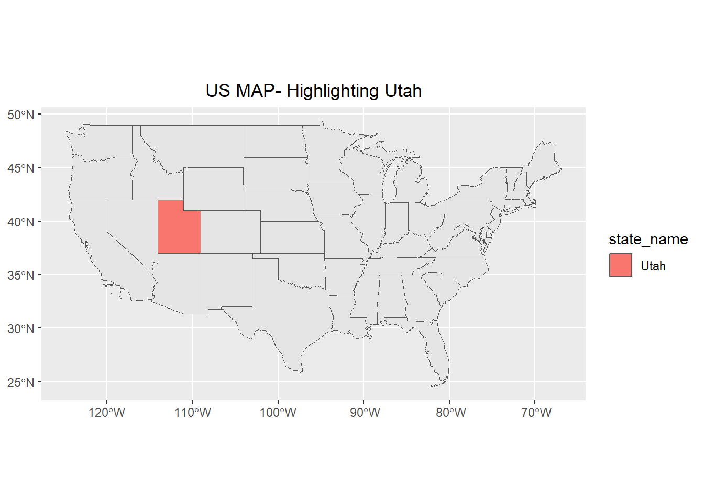
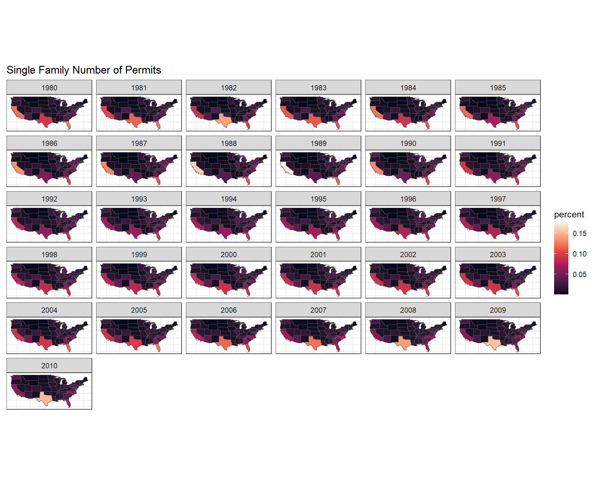
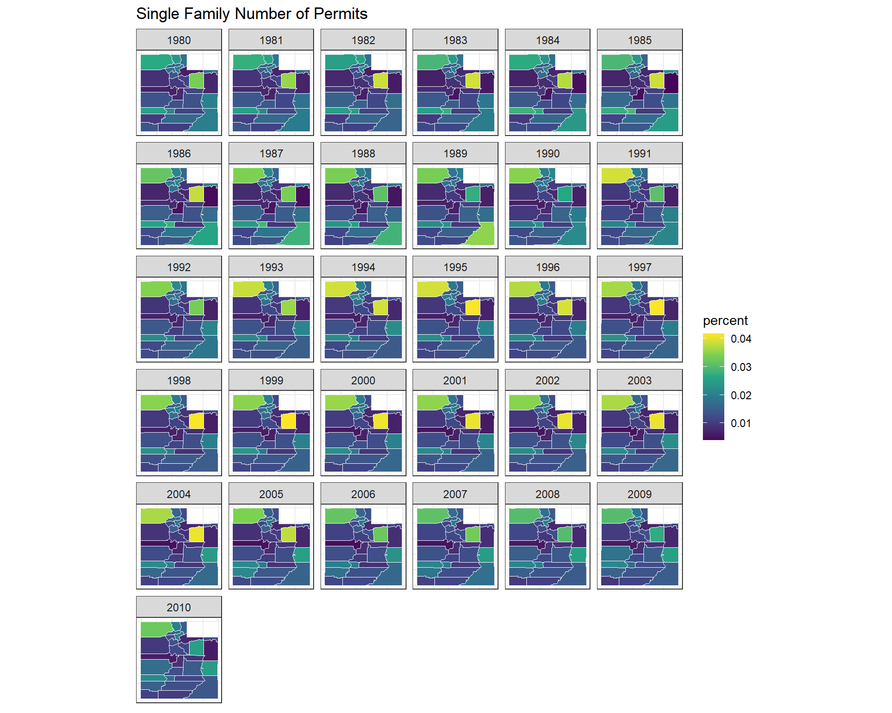

## Background
You have been asked to support a story for the local paper (that has a web presence) that looks back on the housing collapse and the early effects of residential construction. You have data on residential building permits from 1980 through 2010 for each county in the United States. Your colleague that is writing the article would like a few maps and graphics that highlight the single family building permit patterns across your state as well as the patterns in the US.

Remember the big story is the collapse of new building permits at the initial stages of the 2007–2010 mortgage crisis. Make sure your graphics highlight the collapse in a clear and honest manner.

Resources:
https://hafen.github.io/geofacet/

## Process
### Step 1
Use the library(USAboundaries) package to get two spatial data sets. One for all US states, and the other for counties of a state of your choice (for example, counties of Idaho).

Look through your state data and county data and see if you can identify the columns containing the FIPS numbers. You will need these columns to merge this spatial data to our building permit data.


::: {.cell}

:::

::: {.cell}
::: {.cell-output-display}
{width=672}
:::
:::


### Step 2
Read in the permits data from the devtools::install_github("hathawayj/buildings") package. If you have trouble with devtools, try running remotes::install_github("hathawayj/buildings").

Note: buildings is the name of the package. permits is the name of the dataset within the buildings package.

Wrangle the data into two separate data sets. One data set should look at single family permits at the state level for all US states. The other should look at single family permits at the county level for the state of your choice. -Look through your permit data and identify the FIPS columns.


::: {.cell}
::: {.cell-output .cell-output-stdout}
```
# A tibble: 4 × 7
  state StateAbbr county countyname     variable     year value
  <int> <chr>      <int> <chr>          <chr>       <int> <int>
1     1 AL             1 Autauga County All Permits  2010   191
2     1 AL             1 Autauga County All Permits  2009   110
3     1 AL             1 Autauga County All Permits  2008   173
4     1 AL             1 Autauga County All Permits  2007   260
```
:::
:::

### Step 3-4
Use the FIPS number columns to join the state and county permit data to the state and county spatial data.

Create a chart that shows, for each US state, the trend in single family building permits over time.

Make sure at least one (if not all) of your charts display the data using some sort of spatial/geographical representation (so geofacets, a chloropleth map, etc.).
Also, consider how you can effectively deal with the disparities of scale between geographies. (For example, the number of permits in California in a low year are much higher than the highest year for North Dakota.)


::: {.cell}
::: {.cell-output-display}
{width=960}
:::
:::

### Step5
Create another chart(s) that shows, for each county in your chosen state, the trend in single family building over time. Again, the chart should use some sort of spatial/geographical representation and you should consider how to deal with disparities of scale.


::: {.cell}
::: {.cell-output-display}
{width=960}
:::
:::


## Conclusions

Over time I see that number of single family permit are increasing in several states. For example in 1980, Texas state has less single permit than in 2006 or 2009. This is easily spot when you see the color blue getting dark over time in the graph "Simple family number of permit". However, it is the opposite for Florid where the number of permit has decreased over time. In 1980, 1985 there were more permit than in 2009 and 2010. You can see this in the graph "Simple family number of permit" where Florida when from blue to gray color indicating the decrease. 

For the county graph, there are not cahanges over time in simgle family number of permit.
