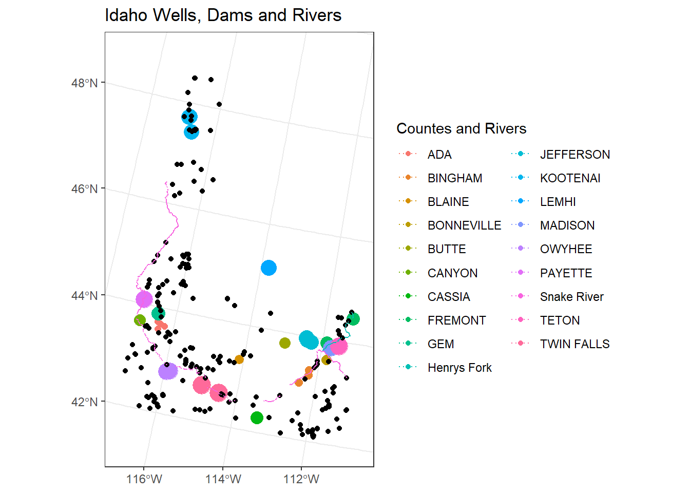

## Reading
Be sure to watch the videos and read the articles that are linked within this reading.
USA Boundaries if you haven’t read it yet

https://byuistats.github.io/M335/online_class/week12-CRS_reading.html

## Background

We have been asked by the state of Idaho to visualize their water systems in the state: wells, dams, and a couple of key rivers.

Though not necessary for this assignment, you may wish to challenge yourself by visiting the Idaho Department of Water Resources website and trying to find the wells dataset and the dams dataset on their site. You can also find files to use in the “Task” portion of the assignment.

### Loading Packages


::: {.cell}

```{.r .cell-code}
# Use this R-Chunk to load the libraries you will use in this file.
library(tidyverse)
library(ggplot2)
library(downloader)
library(ggrepel)
library(USAboundaries)
library(lubridate)
library(sf)
library(dplyr)
library(ggforce)
pacman::p_load(downloader, sf, fs, tidyverse)
#install.packages("USAboundariesData", repos = "https://ropensci.r-universe.dev", type = "source")
```
:::


## Process
### Step1
Read in all four of the necessary SHP file datasets.

::: {.cell}

:::

### Step2

Filter the data so that
- Only well locations with a production of more than 5000 gallons are included
- Only large dams (surface area larger than 50 acres) are included
- The Snake River and Henrys Fork rivers are the only bodies of water that should be included.

::: {.cell}

:::

### Step3
Change the projection so that Idaho is not tilted when plotted.


## MAP
Create a map of Idaho showing these key water system features and save it as a .png file.


::: {.cell}

```{.r .cell-code}
idaho <- state %>% 
  filter(
    StateName== "Idaho")

p<- ggplot(data=idaho)+
  geom_sf(aes(group = StateName ),fill = NA, color= NA)+
  geom_sf(data=dfwell,aes(group = CountyName, size=CountyName, color=CountyName))+
  geom_sf(data=dfdams,aes(group = DamName))+
  geom_sf(data=dfwater,aes(group = FEAT_NAME, color=FEAT_NAME),linetype = "dotted", size = 5.5)+
  labs(title = "Idaho Wells, Dams and Rivers")+
  theme_bw()+
   guides(color = guide_legend( 
                override.aes=list(shape = 16, size=4)))

p+guides(size = "none")+ # eliminate second legend+
  guides(color = guide_legend(ncol = 2))+
  labs( color="Countes and Rivers")
```

::: {.cell-output-display}
{width=672}
:::

```{.r .cell-code}
# 
# ggplot(data=idaho)+
#   geom_sf(aes(group = StateName))+
#   geom_sf(data=dfwell,aes(color= CountyName), show.legend = "point")+
#   geom_sf(data=dfdams,aes(group = DamName))+
#   geom_sf(data=dfwater,aes(group = FEAT_NAME, fill=FEAT_NAME))+
#   labs(title = "Idaho Wells, Dams and Rivers")+
#   theme_bw()


ggsave("map1.png", width = 15, height = 10)  
```
:::


## Conclusions

NA
