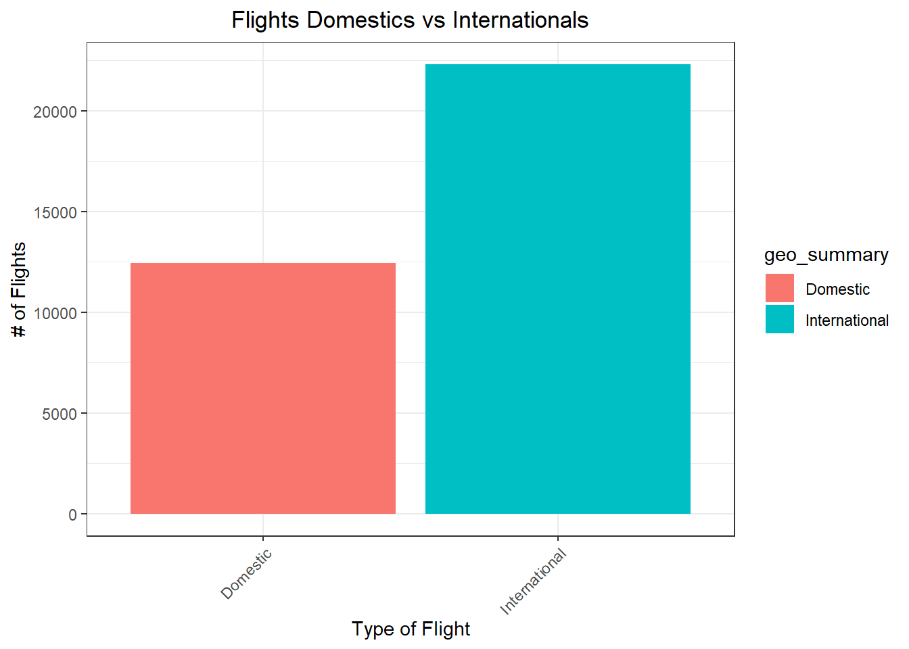
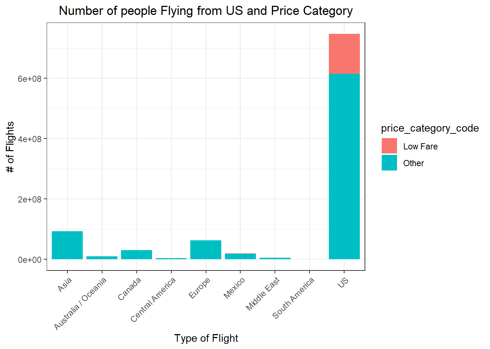
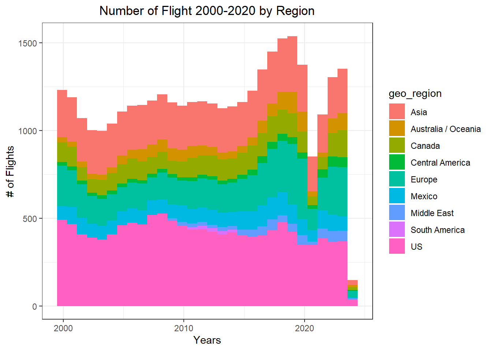

## Background

Finding good data takes time, and can take longer than the time to tidy your data. This task could easily take three to six hours to find the data you need for your semester project. You may not finish this task this week, but you should definitely start it so that you are not rushed at the end of the semester. After you find good, potential data sources pick one to focus on working with for this task.

Don’t be afraid to pivot or change directions if you find a dataset that sparks your interest or cannot find data to answer your initial question.

### Free Data
There are lots of sites that recommend other sites for finding free data, here is one of them: Finding data to answer your question. A couple of other fun places include

Data is Plural is a newsletter that sends you interesting datasets every week. Scroll through the archive and see if any topics jump out at you!

Tidy Tuesday is a community of R users that explore and visualize a new dataset every Tuesday. This GitHub account contains every dataset used in Tidy Tuesday. Click on the “data” folder and then pick a year to start exploring.

https://www.dataquest.io/blog/free-datasets-for-projects/

https://www.data-is-plural.com/archive/

https://github.com/rfordatascience/tidytuesday

http://datadiscoverystudio.org/geoportal/rest/metadata/item/cd6bc720ff12496a820dcd21e5b17a5d/html

## Packages


::: {.cell}

```{.r .cell-code}
library(downloader) # download 
library(ggplot2) # graphs
library(tidyverse)# cleaning
library(janitor)
```
:::

## Picking
Create an .qmd file or R script that has links to data sources with a description of the quality of each.

Check out 3-5 potential data sets/sources (that are free). Choose one dataset to focus on for this assignment (later you may bring in the other sources or switch to another source)

Of the 3-5 potential data sources you found, pick 1 to focus on for this task. Build an R script or markdown file that reads in, formats, and visualizes the data using the principles of exploratory analysis.

::: {.cell}

```{.r .cell-code}
# FLights from ant to us
download("https://data.sfgov.org/api/views/rkru-6vcg/rows.csv",dest="myxl.csv", mode="wb")
flight<- read_csv("myxl.csv")


#Salaries by profession 
download("https://data.montgomerycountymd.gov/api/views/48wg-fkab/rows.csv?date=20231105&accessType=DOWNLOAD",dest="salary.csv", mode="wb")

salary<-read.csv("salary.csv")


#covid geography
download("https://github.com/fivethirtyeight/data/raw/master/covid-geography/mmsa-icu-beds.csv",dest="covid.csv", mode="wb")
covid<-read.csv("covid.csv")


#thanksgiving data
download("https://github.com/josegabrielguerrero26/datasets/raw/master/thanksgiving-2015/thanksgiving-2015-poll-data.csv", dest="thanks.csv",mode="wb")
thanks<-read.csv("thanks.csv")
```
:::


## Graph 
Create two to three quick visualizations that you used to check the quality of your data. (Keep the code for at least one of them.)

::: {.cell}

```{.r .cell-code}
ctm2 <- clean_names(flight)

sum(is.na(ctm2))# give a resume if missing values
```

::: {.cell-output .cell-output-stdout}
```
[1] 632
```
:::

```{.r .cell-code}
colSums(ctm2==0) # give a resume with sum of ceros
```

::: {.cell-output .cell-output-stdout}
```
            activity_period  activity_period_start_date 
                          0                           0 
          operating_airline operating_airline_iata_code 
                          0                          NA 
          published_airline published_airline_iata_code 
                          0                          NA 
                geo_summary                  geo_region 
                          0                           0 
         activity_type_code         price_category_code 
                          0                           0 
                   terminal               boarding_area 
                          0                           0 
            passenger_count                  data_as_of 
                          2                           0 
             data_loaded_at 
                          0 
```
:::

```{.r .cell-code}
ggplot(data = ctm2) +
  geom_bar(mapping = aes(x = geo_summary, fill=geo_summary))+
    theme_bw()+
    ylab("# of Flights")+
    xlab("Type of Flight")+
    ggtitle("Flights Domestics vs Internationals")+ theme(plot.title = element_text(hjust = 0.5))+        theme(axis.text.x = element_text(angle=45, hjust = 1))
```

::: {.cell-output-display}
{width=672}
:::

```{.r .cell-code}
ggplot(data = ctm2) +
  geom_col(mapping = aes(x = geo_region,y=passenger_count, fill=price_category_code))+
      theme_bw()+
    ylab("# of Flights")+
    xlab("Type of Flight")+
    ggtitle(" Number of people Flying from US and Price Category ")+ 
  theme(plot.title = element_text(hjust = 0.5))+
  theme(axis.text.x = element_text(angle=45, hjust = 1))
```

::: {.cell-output-display}
{width=672}
:::

```{.r .cell-code}
ggplot(data = ctm2) +
  geom_histogram(mapping = aes(x = activity_period_start_date, fill=geo_region))+
    theme_bw()+
    ylab("# of Flights")+
    xlab("Years")+
    ggtitle(" Number of Flight 2000-2020 by Region ")+
    theme(plot.title = element_text(hjust = 0.5))
```

::: {.cell-output-display}
{width=672}
:::
:::


## Conclusions

Think through limitations of the compiled data in addressing your original question.
Furthermore, you should be thinking about and begin to address any follow-on or alternate questions that you could use for your project.

I think I need to add more information about the flights to complete my analysis.


