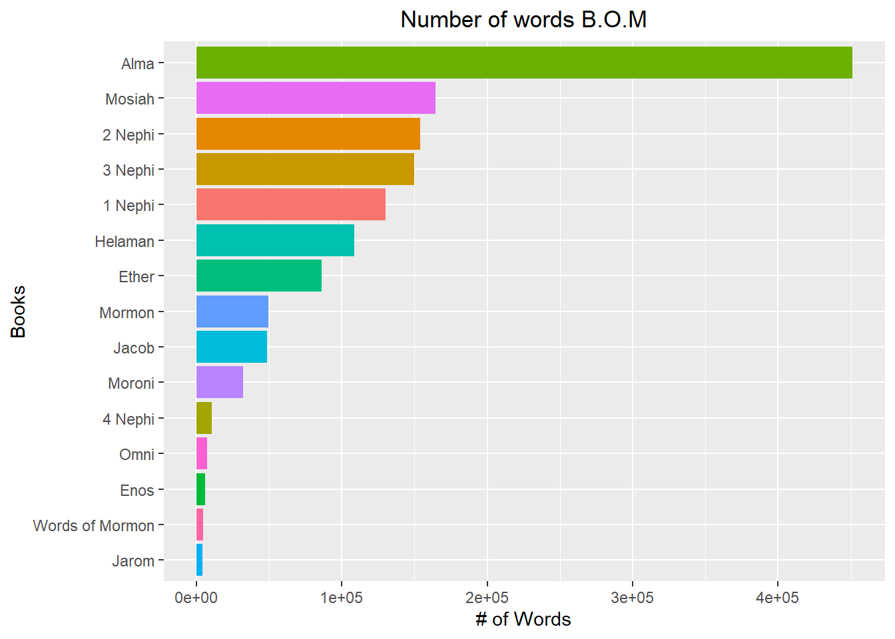

## Resources

Readings
These readings are focused on working with factors in R

Chapter 15: R for Data Science—Factors http://r4ds.had.co.nz/factors.html

Forcats R package http://stat545.com/block029_factors.html

Optional: the stringi R package offers additional, less commonly needed functions for working with strings.
Guided Instruction
In this file, the “Extra Enrichment” section is just that, extra. It demonstrates some things the book doesn’t cover and may come in handy someday in the future, but you can skim it or skip it entirely to make time for mastering more critical skills. Factors and forcats. https://rdrr.io/rforge/stringi/man/stri_stats_latex.html

## Background

In 1978 Susan Easton Black wrote an Ensign article, Names of Christ in the Book of Mormon that states: “Even statistically, he is the dominant figure of the Book of Mormon.”

We are going to use some of our string skills to count words in the New Testament and in the Book of Mormon.

## Process

### Step 1
In a previous week we learned to download zip files, unzip them, and then read in their content. This process is greatly simplified with the rio package (dealing with zipped folders may be more tricky). rio is a package that can read in a wide variety of file types with one easy command. After installing the rio package download the data using this code:


::: {.cell}

:::

### Average verse
Calculate the average verse length (number of words) in the New Testament compared to the Book of Mormon.

::: {.cell}
::: {.cell-output .cell-output-stdout}
```
# A tibble: 1 × 1
  BOM_words
      <dbl>
1      213.
```
:::

::: {.cell-output .cell-output-stdout}
```
# A tibble: 1 × 1
  New_test_words
           <dbl>
1           118.
```
:::
:::

### Counting "Jesus"
Count how often the word “Jesus” is used in the New Testament compared to the Book of Mormon.

::: {.cell}
::: {.cell-output .cell-output-stdout}
```
# A tibble: 1 × 1
  New_Testament_Jesus
                <int>
1                 976
```
:::

::: {.cell-output .cell-output-stdout}
```
# A tibble: 1 × 1
  BOM_Jesus
      <int>
1       184
```
:::
:::


### Visualization

Create a visualization to show the distribution of word count by verse for each book in the Book of Mormon.
Count how many words there are per verse
Since there are 15 books, you should graphically depict/summarize 15 distributions of word counts.


::: {.cell}

```{.r .cell-code}
bfm2<-bfm %>%
    select(book_title,scripture_text) %>%
    mutate(length = str_count(scripture_text))%>%
    group_by(book_title)%>%
    summarise(BOM_words=sum(length))


ggplot(data = bfm2, mapping = aes(x=reorder(book_title,BOM_words), y =BOM_words, fill=book_title)) +
  coord_flip() +
  geom_col() +
  labs(x = "Books",
       y = "# of Words",
       title = "Number of words B.O.M")+
  theme(plot.title = element_text(hjust = 0.5),
        plot.subtitle = element_text(hjust = 0.5),
        legend.text  = element_blank(),
        legend.position = "none")
```

::: {.cell-output-display}
{width=672}
:::
:::
