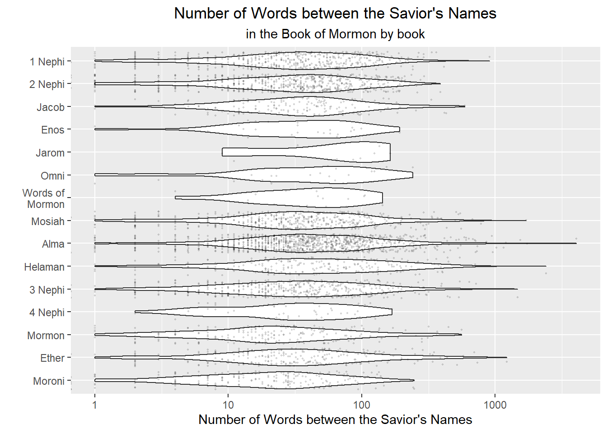

## Resources
The Book of Mormon. This link is for reference only. You don’t have to read the full BOM before completing this assignment, but you should reading some each day :).

## Background

In 1978 Susan Easton Black stated, “Even statistically, he [Christ] is the dominant figure of the Book of Mormon.”

With our strong “string” skills we are going to check her results and build an improved statistic using number of words between references.

## Process

### Step 1
Get the scripture and savior name data into R.

Scripture Text: Use the same data as the Counting Words task. You don’t have to download it again if you stored it on your computer. See the Counting Words for code to complete this step.

Savior Names: Use read_rds(url("https://byuistats.github.io/M335/data/BoM_SaviorNames.rds")) or read_rds("https://byuistats.github.io/M335/data/BoM_SaviorNames.rds") to download and load the Savior names table into R. (Or try experimenting with rio::import() to read in the data)


::: {.cell}

:::

### Step 2
Use the list of Savior names and the Book of Mormon text to find the distribution of number of words between references to the Savior.

1. Split the string on each instance of a Savior name in the Book of Mormon
2. Then count the number of words between each instance.

::: {.cell}
::: {.cell-output .cell-output-stdout}
```
# A tibble: 15 × 4
# Groups:   book_title [1]
   book_title words mean  index
   <fct>      <int> <chr> <int>
 1 1 Nephi       38 53        1
 2 1 Nephi       17 53        2
 3 1 Nephi      135 53        3
 4 1 Nephi       21 53        4
 5 1 Nephi       94 53        5
 6 1 Nephi       18 53        6
 7 1 Nephi        8 53        7
 8 1 Nephi       94 53        8
 9 1 Nephi       73 53        9
10 1 Nephi        8 53       10
11 1 Nephi        0 53       11
12 1 Nephi       55 53       12
13 1 Nephi       22 53       13
14 1 Nephi      123 53       14
15 1 Nephi      100 53       15
```
:::
:::

## Visualization
Create a visualization of the distribution of words between savior names.
Can you get the plot to “tell a story”?


::: {.cell}
::: {.cell-output-display}
{width=672}
:::

::: {.cell-output .cell-output-stdout}
```
[1] "Average Words Between: 60.07"
```
:::
:::


## Conclusions

Graph is showing the distribution of the Jesus Christ names in the book of Mormon per book. It seems that Ether, Helaman, Alma are a few of then with the largest distribution. 