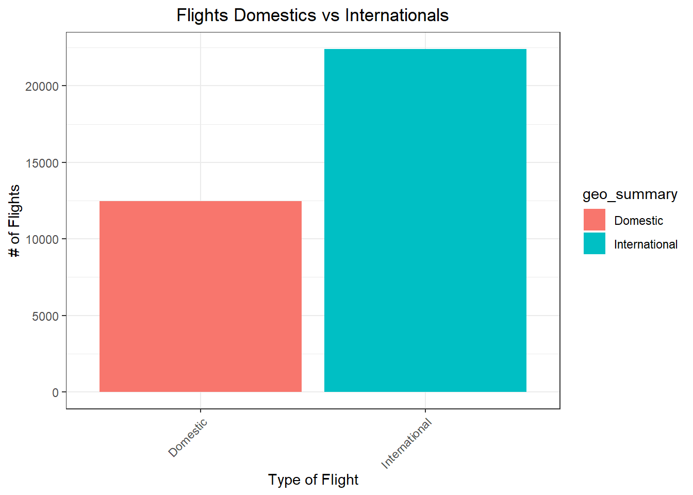
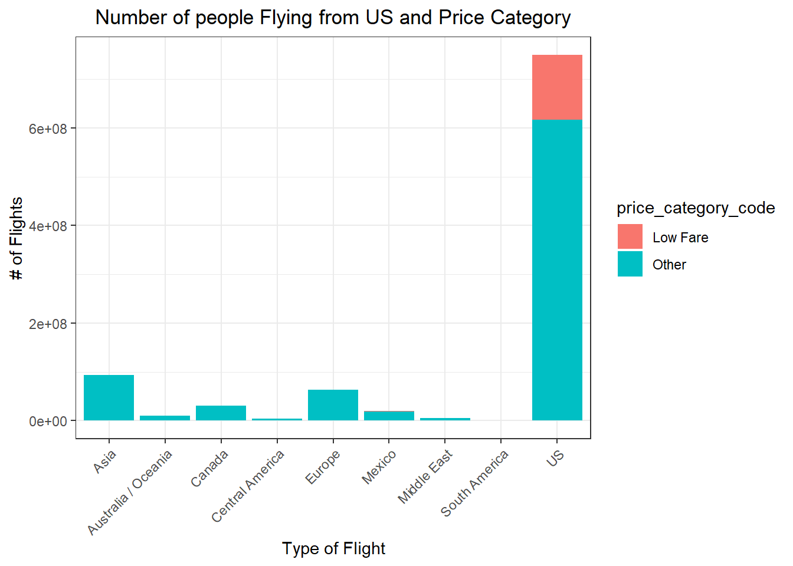
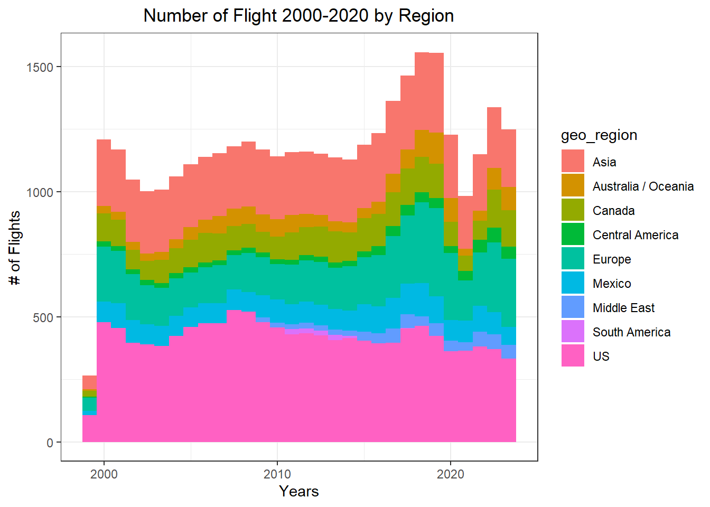
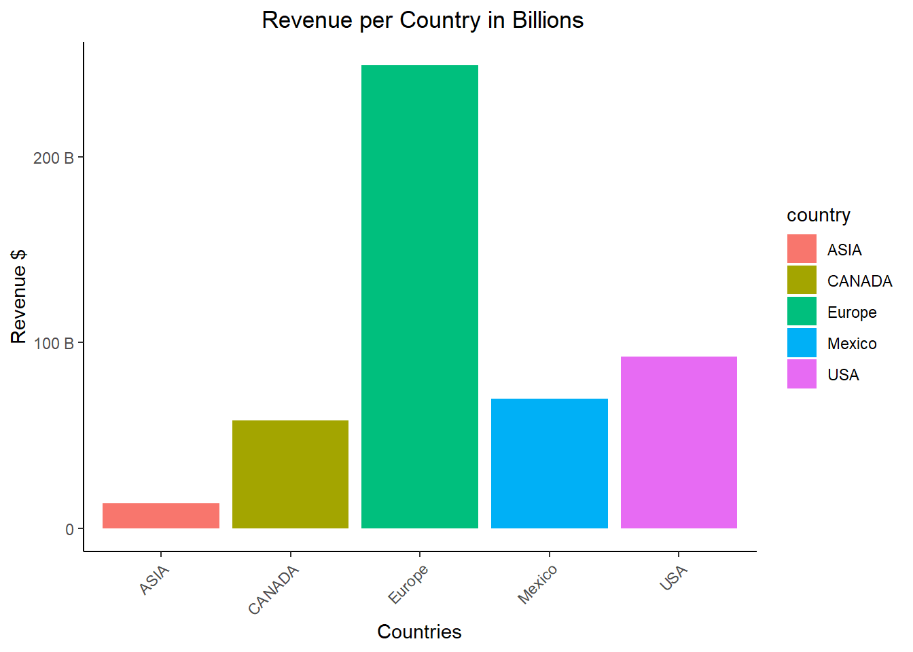
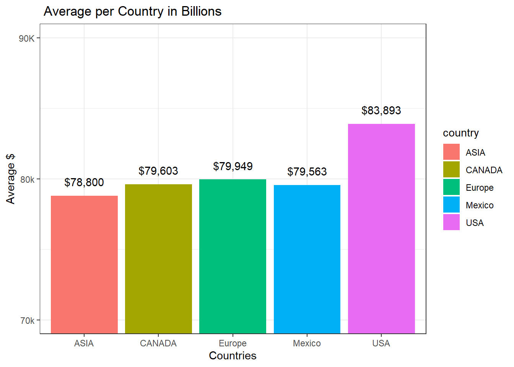

## Background

This is a rental company looking at answering the following question:
Where should I open a new retail store? To answer that question, I am
going to use data the following data:

1.  Flights between the united state
2.  Dataset from revenue previous years.

From the rev datset I was connected to the database the code is below
but I have exported the csv to my github. Some adjusted were done for
privacy.

## Process

### Getting from DATABASE

This is just to demonstrate what it was done to get the databases from
the data source.

*mydb \<- dbConnect(MySQL(),*

*dbname = "hertz_rev",*

*host = "w3.amazon.b3/34534_XXXXXXX",*

*port = 33XX,*

*user = "bus_intXXXXXX",*

*password = "XXXXXXXXXXXXXX")*

*dbListTables(mydb)*

### Packages Load


::: {.cell}

```{.r .cell-code}
library(downloader) # download 
library(ggplot2) # graphs
library(tidyverse)# cleaning
library(janitor)
```
:::


## Selecting

Selecting the needed databases from different sources.


::: {.cell}

```{.r .cell-code}
# FLights from ant to us
download("https://data.sfgov.org/api/views/rkru-6vcg/rows.csv",dest="myxl.csv", mode="wb")
flight<- read_csv("myxl.csv")

download("https://github.com/josegabrielguerrero26/datasets/raw/master/revs.csv", dest="revs.csv", mode="wb")
rev<- read_csv("revs.csv")
```
:::


## Understanding Market Size in Flight Terms


::: {.cell}
::: {.cell-output-display}
{width=672}
:::

::: {.cell-output-display}
{width=672}
:::

::: {.cell-output-display}
{width=672}
:::
:::


## Understanding Business in Term of Sales

::: {.cell}

```{.r .cell-code}
#rev
rev_c<-rev%>%
  rename_with(.cols = 1, ~"revenue")%>%
  rename_with(.cols = 2, ~"dates")%>%
  rename_with(.cols = 3, ~"country")%>%
  rename_with(.cols = 4, ~"code")%>%
  rename_with(.cols = 5, ~"ras")%>%
  rename_with(.cols = 6, ~"days_contracts")%>%
  mutate(dates_f=as.Date(dates, format="%m/%d/%y"))%>%
  subset(select = -c(dates))
#rev_c

#str(rev_c)
# colnames(rev_c)

rev_r<- select(rev_c,country,revenue,ras,days_contracts)

rev_c<- rev_r%>%
  group_by(country)%>%
   summarise(rev_total=sum(revenue),
             ave_total=mean(revenue),
            n_contracts=sum(ras),
            rented_days=sum(days_contracts))

#rev_c
ggplot() +
  geom_col(data = rev_c,mapping = aes(x = country,y=rev_total, fill=country))+
  #geom_point(data = rev_c,mapping = aes(x = country,y=ave_total))+
    theme_classic()+
    ylab("Revenue $")+
    xlab("Countries")+
    ggtitle(" Revenue per Country in Billions")+ 
  theme(plot.title = element_text(hjust = 0.5))+
  theme(axis.text.x = element_text(angle=45, hjust = 1))+
  scale_y_continuous(breaks =seq(0,2.5e9, by=1e9), 
                       labels = c("0","100 B", "200 B"))
```

::: {.cell-output-display}
{width=672}
:::

```{.r .cell-code}
ggplot() +
  geom_col(data = rev_c,mapping = aes(x = country,y=ave_total, fill=country))+
    ylab("Average $")+
    xlab("Countries")+
    ggtitle(" Average per Country in Billions")+ 
  theme(plot.title = element_text(hjust = 0.5))+
  theme(axis.text.x = element_text(angle=45, hjust = 1))+
  scale_y_continuous(breaks =seq(7e4,10e04, by=1e4), 
                       labels = c("70k","80k","90K", "100K"))+
    theme_bw()+
   coord_cartesian(ylim=c(7e4,9e04))+
   geom_text(data=rev_c, aes( x=country, y=ave_total+10e2,label = scales::dollar(round(ave_total, 0))))
```

::: {.cell-output-display}
{width=672}
:::
:::


## Conclusions
Based on the database and the graphs presented,I would strongly suggest to open more offices in USA followed by Europe. It is interesting to see that even though the Europe Market brings 3 times more revenue to the company the U.S market has a better return per unit. This means that I´d prefer to open more offices in thge USA market than Europe.

